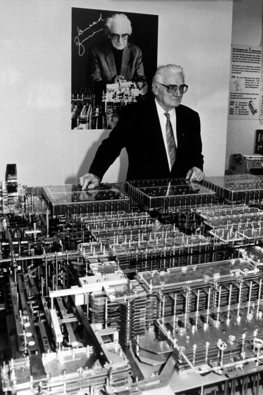

## Kurze Geschichte der [Computer](https://de.wikipedia.org/wiki/Geschichte_des_Computers) und [Programmiersprachen](https://de.wikipedia.org/wiki/Geschichte_der_Programmiersprachen)

### Computer vor 1950

*Computer* war einmal eine [Jobbeschreibung](https://en.wikipedia.org/wiki/Computer_(job_description)): vom 17.- 20. Jahrhundert wurden Berechnungen von Hand ausgeführt - und das oft von Frauen (siehe Bild links: die Harvard Computers).

Das erste Computerprogramm, das von einer Rechenmaschine ausgeführt werden sollte, wurde 1842/1843 von [Ada Lovelace](https://de.wikipedia.org/wiki/Ada_Lovelace) formuliert. Es handelt sich um eine Vorschrift für die Berechnung der [Bernoulli-Zahlen](https://de.wikipedia.org/wiki/Bernoulli-Zahl).

In der industriellen Revolution zu Beginn des 19. Jahrhunderts wurden immer komplexere Maschinen gebaut, um ehemals handwerkliche Tätikeiten zu verrichten. Ein Beispiel dafür ist der [Jacquardwebstuhl](https://de.wikipedia.org/wiki/Jacquardwebstuhl), bei dem via [Lochkarten](https://de.wikipedia.org/wiki/Lochkarte) verschiedene Webmuster "programmiert" werden konnten.

### Computer nach 1950

In der ersten Hälfte des 20. Jahrhunderts wurden die logischen Grundlagen für die Programmierung von Rechenmaschinen entwickelt. 1937-1941 baute Konrad Zuse den [ersten funktionsfähige Rechenmaschine der Welt](https://de.wikipedia.org/wiki/Konrad_Zuse#Z3_–_der_erste_funktionsfähige_Computer_der_Welt) in Berlin.

> Ich bin zu faul zum Rechnen. [Konrad Zuse]

In den 1950er Jahren haben sich die ersten modernen Programmiersprachen entwickelt (FORTRAN, LISP, COBOL). Für diese Sprachen wird ein [Compiler](https://de.wikipedia.org/wiki/Compiler) benötigt. Das ist eine Art Übersetzungsprogramm, das von Menschen lesbaren Programmcode in [Maschinensprache](https://de.wikipedia.org/wiki/Maschinensprache) übersetzt. 

[Grace Hopper](https://de.wikipedia.org/wiki/Grace_Hopper) „Grandma COBOL“ beharrte auf einer allgemeinverständlichen Sprache für Programme, woraufhin Compiler, Interpreter und [höhere Programmiersprache](https://de.wikipedia.org/wiki/Höhere_Programmiersprache) entstanden sind.

Bekannte Sprachen, die vor der Ausführung komplett Kompiliert werden sind C, C++ und Fortran. Im Gegensatz dazu stehen Programmiersprachen, die "on the fly" übersetzt werden, sogenannte Skriptsprachen oder interpretierte Sprachen, wie Ruby, Perl und Python. Der große Vorteil von interpretierten Sprachen ist, dass das Programm noch während der Ausführung erweitert werden kann.

### Weiterführende (unterhaltsame) Texte

* [Chaos Computer Buch](https://monoskop.org/images/b/ba/Wieckmann,_Jürgen_%28ed.%29_-_Das_Chaos_Computer_Buch._Hacking_made_in_Germany_%28German%29.pdf), Seite 125, Die Drei Hände des Zeichners, Peter Glaser
