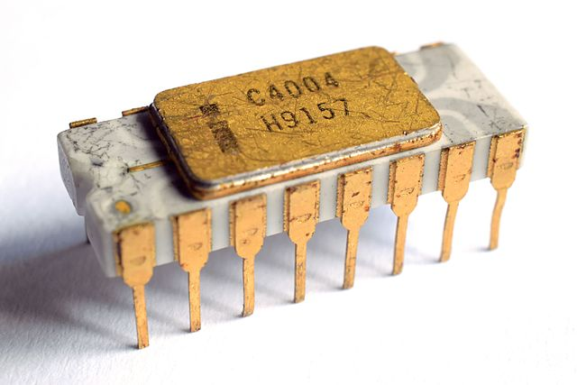

## Kurze Geschichte der [Computer](https://de.wikipedia.org/wiki/Geschichte_des_Computers) und [Programmiersprachen](https://de.wikipedia.org/wiki/Geschichte_der_Programmiersprachen)

### Entwicklung bis 1940

*Computer* war einmal eine [Jobbeschreibung](https://en.wikipedia.org/wiki/Computer_(job_description)): vom 17.- 20. Jahrhundert wurden Berechnungen von Hand ausgeführt - und das oft von Frauen (siehe Bild links: die Harvard Computers).

Das erste Computerprogramm, das von einer Rechenmaschine ausgeführt werden sollte, wurde 1842/1843 von [Ada Lovelace](https://de.wikipedia.org/wiki/Ada_Lovelace) formuliert. Es handelt sich um eine Vorschrift für die Berechnung der [Bernoulli-Zahlen](https://de.wikipedia.org/wiki/Bernoulli-Zahl).

In der industriellen Revolution zu Beginn des 19. Jahrhunderts wurden immer komplexere Maschinen gebaut, um ehemals handwerkliche Tätikeiten zu verrichten. Ein Beispiel dafür ist der [Jacquardwebstuhl](https://de.wikipedia.org/wiki/Jacquardwebstuhl), bei dem via [Lochkarten](https://de.wikipedia.org/wiki/Lochkarte) verschiedene Webmuster "programmiert" werden konnten.

### 1940-1970: erste Rechenmaschinen und Programmiersprachen

1937-1941 baute [Konrad Zuse](https://de.wikipedia.org/wiki/Konrad_Zuse) die erste funktionsfähige Rechenmaschine der Welt in Berlin - den [Z3](https://de.wikipedia.org/wiki/Konrad_Zuse#Z3_–_der_erste_funktionsfähige_Computer_der_Welt) (siehe Bild rechts). Nur wenige Jahre später wurden auch in den USA verschiedene *Universelle Rechenmaschinen* gebaut: Colossus, Mark I und ENIAC.

> Ich bin zu faul zum Rechnen. [Konrad Zuse]

Während des zweiten Weltkriegs spielten die ersten Computer eine große Rolle um verschlüsselte Nachrichten zu dechiffrieren. Allerings mussten diese Rechner in [Maschinensprache](https://de.wikipedia.org/wiki/Maschinensprache) programmiert werden - also meist in Binärcode.

[Grace Hopper](https://de.wikipedia.org/wiki/Grace_Hopper) beharrte auf einer allgemeinverständlichen Sprache für Programme, woraufhin Compiler und [höhere Programmiersprachen](https://de.wikipedia.org/wiki/Höhere_Programmiersprache) entstanden sind. Ein [Compiler](https://de.wikipedia.org/wiki/Compiler) ist eine Art Übersetzungsprogramm, das von Menschen lesbaren Programmcode in Maschinensprache übersetzt. Beispiele für frühe Programmiersprachen sind FOTRAN, COBOL, ALGOL oder BASIC.

### 1970-1990: Integrierte Schaltkreise und erste Betriebssysteme

Computer, die auf Relais und Elektronenröhren basierten wurden immer größer - und kamen an ihre Grenzen.

Ein bedeutender Schritt in der Entwicklung von Rechnern sind die [Integrierten Schaltkreise](https://de.wikipedia.org/wiki/Integrierter_Schaltkreis). Hier wird die Schaltung direkt auf ein dünnes Plättchen aus Halbleiter-Material aufgebracht.

1971 war der erste Mikroprozessor kommerziell verfügbar: der [Intel C4004](https://de.wikipedia.org/wiki/Intel_4004) (siehe Bild links) konnte etwa 600.000 Berechnungen mit jeweils 4 bit pro Sekunde ausführen. Zum Vergleich: der Z3 hatte eine Taktrate von 5-10 Berechnungen pro Sekunde mit 22 bit. (Dein Computer arbeitet vermutlich mit [64 bit](https://de.wikipedia.org/wiki/64-Bit-Architektur)!)

Die ersten Rechner hatten zudem kein [Betriebssystem](https://de.wikipedia.org/wiki/Betriebssystem). Mit zunehmender Komplexität war jedoch ein Programm nötig, das die Ressourcen des Rechners und die Interaktion mit dem User verwaltet.

> UNIX is very simple, it just needs a genius to understand its simplicity. [Dennis Ritchie]

Zu Beginn der 70er Jahre entwickelten [Ken Thompson](https://en.wikipedia.org/wiki/Ken_Thompson) und [Dennis Ritchie](https://de.wikipedia.org/wiki/Dennis_Ritchie) (siehe rechts) an den Bell Laboratories den ersten Kernel des [UNIX](https://de.wikipedia.org/wiki/Unix)-Betriebssystems sowie die Programmiersprache [C](https://de.wikipedia.org/wiki/C_(Programmiersprache)). Zur selben Zeit wurden auch Vorläufer des Windows-Betriebssystems entwickelt.

In den 80er Jahren gab es die ersten erschwinglichen Heimcomputer, wie z.B. den [Commodore 64](https://de.wikipedia.org/wiki/Commodore_64) (siehe unten links). Dieser bot eine Taktfrequenz von etwa 1 MHz (= 1.000.000 Berechnungen / Sekunde) bei 8 bit, einem Arbeitsspeicher von 64 KB und ausschließlich externem Massenspeicher (Diskette). Er gilt mit geschätzten Verkaufszahlen von 12,5 bis 30 Millionen Stück als meistverkaufter [Personal Computer](https://de.wikipedia.org/wiki/Personal_Computer) überhaupt.

Anfang der 80er kamen die ersten PCs mit einer grafischen Benutzeroberfläche (GUI = Graphical User Interface) auf den Markt. Apple war Vorreiter dieses Konzepts (siehe unten rechts, Apple Macintosh 1984) - aber auch andere Firmen folgten kurz darauf wie z.B. [Atari](https://de.wikipedia.org/wiki/Atari_ST)(siehe unten rechts) und auch [Windows](https://de.wikipedia.org/wiki/Microsoft_Windows).

Seit dem C4004 hat sich die Anzahl von Transistoren auf einem Mikrochip alle zwei Jahre ungefähr verdoppelt. Dieser Zusammenhang wurde als erstes von Gordon Moore beobachtet und ist daher auch als [Mooresches Gesetz](https://de.wikipedia.org/wiki/Mooresches_Gesetz) bekannt. 

### Die 1990er Jahre: Der Beginn des Internets!

### Weiterführende (unterhaltsame) Texte

* [Chaos Computer Buch](https://monoskop.org/images/b/ba/Wieckmann,_Jürgen_%28ed.%29_-_Das_Chaos_Computer_Buch._Hacking_made_in_Germany_%28German%29.pdf), Seite 125, Die Drei Hände des Zeichners, Peter Glaser
