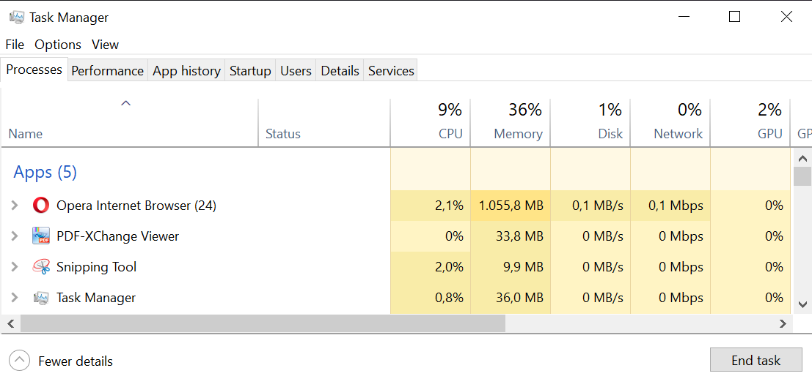

# Computer (Science)

## Wie funktionieren Computer?

Rechner können Anweisungen ausführen, die Menschen ihnen geben. Die wichtigsten Bausteine eines Computers sind:

* Prozessor (CPU = Central Processing Unit)
* Speicher (Arbeitsspeicher + Festplatte)
* Peripherie (Tastatur, Maus, Display, ...)

Der Prozessor ist das zentrale Rechenwerk, in dem die geforderten Operationen ausgeführt werden. Arbeitsspeicher und Prozessor arbeiten eng zusammen: im Arbeitspeicher (RAM  = Random Access Memory) wird die Information gespeichert, die für den aktuellen Prozess / das aktuell ausgeführte Programm relevant sind. Für langfristiges Speichern von Dateien wird die Festplatte genutzt.

Im sogenannten *Task-Manager* kann man sich (unter Windows) alle laufenden Prozesse und zugehörigen Ressourcen anzeigen lassen.

## Machine-Speak?

Informationsspeicherung und Verarbeitung über Physikalische Zustände. 0/1 ... Binärdarstellung!!!

- high-level (Menschenlesbar)
- mid-level (Gerätetreiber)
- low-level (Maschinensprache)

Rechner basieren auf physikalischen Zuständen, meist Spannungen oder Magnetfelder. Dabei erfolg die Kodierung von Informationen in einer [binären Darstellung](https://de.wikipedia.org/wiki/Dualsystem)  - das heißt, es gibt nur zwei Zustände: an/aus - wahr/falsch - 1/0.
Das Binärsystem wurde schon  im 3. Jahrhundert v. Chr. in Indien benutzt, in Europa wurde es Ende des 17. Jahrhunderts von [Gottfried Wilhelm Leibniz](https://de.wikipedia.org/wiki/Gottfried_Wilhelm_Leibniz) "entdeckt" und mit dem christlichen Glauben begründet.

|Dezimalzahl|Binärdarstellung|
|---|---|
|1|1|
|2|10|
|3|11|
|7|111|
|31|11111|
|32|100000|

1847 veröffentlichte der britische Mathematiker [George Boole](https://de.wikipedia.org/wiki/George_Boole) das Buch  *The Mathematical Analysis of Logic*, welches die Verbindung von Binären Zahlen mit Logischen Operationen herstellt - diese Darstellung ist bis heute als [Boolsche Algebra](https://de.wikipedia.org/wiki/Boolesche_Algebra) bekannt. Erst durch diese Grundlage war es möglich, Computer zu bauen, die Logische Operationen durchführen. "Einfache" Beispiele für [Bitweise Operationen](https://de.wikipedia.org/wiki/Bitweiser_Operator) sind NICHT, UND, ODER, XOR.

## Betriebssysteme

Betriebssysteme dienen dazu, Menschen die Bedienug von Computern zu erleichtern bzw. erst zu ermöglichen. Die bekanntesten Betriebssysteme sind Windows, MacOS und Linux.

Eines der ersten viel benutzten Betriebssysteme ist [MS-DOS](https://de.wikipedia.org/wiki/MS-DOS).

## Ressourcen

* [How Computers Work](https://cs50.harvard.edu/ap/2020/assets/pdfs/how_computers_work.pdf)
* [Intro to Computer Science](https://en.wikiversity.org/wiki/Introduction_to_Computer_Science)

