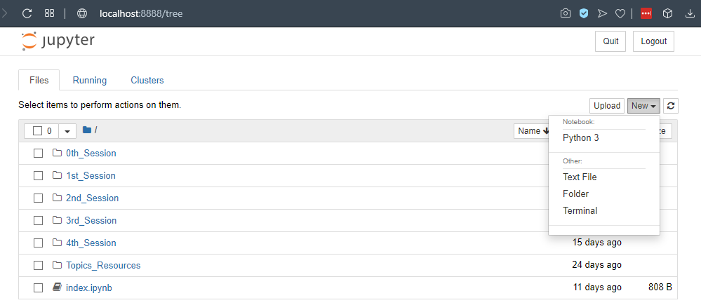

# Jupyter Notebooks

Jupyter (früher IPython) Notebook ist eine Browser-basierte Python-Umgebung, die auf [interactive Computing](https://en.wikipedia.org/wiki/Interactive_computing) basiert. Wie beim starten eines Python programms im interaktiven Modus (mit der Flag `-i`), könnt ihr in diesen Notebooks ständig das Programm erweitern, während es läuft. [Project Jupyter](https://de.wikipedia.org/wiki/Project_Jupyter) ist nicht auf Python beschränkt, sondern erlaubt sogar mehrere Programmiersprachen in einer Datei zu benutzen.

Um Jupyter Notebook zu starten, gib `jupyter notebook` in die Konsole ein. Die Umgebung öffnet sich in dem Ordner, wo sich die Konsole befindet, wenn ihr  `jupyter notebook` ausführt. Als nächstes öffnet sich ein Browsterfenster, das ungefähr so aussieht:

Hier könnt ihr in den Ordnern navigieren, Dateien öffnen und neue Jupyter Notebooks erstellen (mit `Neu --> Python3`). In der 0. Session findet ihr ein Beispiel-Notebook, das sich selbst erklärt. Probiert es aus!

  <iframe src="https://www.youtube.com/embed/1sHreSfc-qQ" allowfullscreen></iframe>

