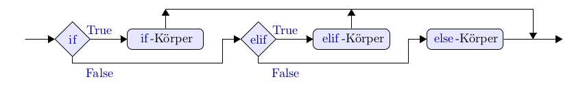
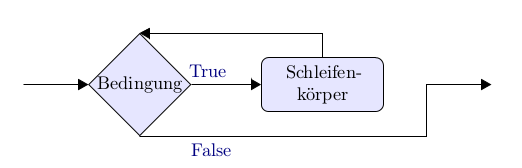

# Control Flow (Part 1)

Beim Programmieren tritt häufig der Fall auf, dass Teile des Codes nur unter einer gewissen Bedingung ausgeführt werden sollen.

Bedingungen werden über Boolsche Variablen abgefragt, also `True` und `False`.

In vielen anderen Programmiersprachen wird Code mit Klammern strukturiert - in Python allerdings funktioniert die Struktur über **Einrückungen von Blöcken**.

## Coder unter Bedingungen ausführen

### if .. elif .. else

Ist die Bedingung nach dem `if` erfüllt, wird der darauffolgende Block ausgeführt. Gibt es ein darauffolgendes  `else` wird der Codeblock dort ausgeführt, wenn die Bedingung nicht erfüllt ist. Will man weitere Bedingungen einfügen, wird `elif` benutzt.

Nicht jede `if` - Abfrage muss auch ein `else` oder `elif` enthalten. Hier ein Beispiel:

```
zahl = 42

if zahl > 42:
    print("Das ist nicht die Antwort auf die Frage.")
elif zahl == 42:
    print("Aha!")
else:
    print("Die Zahl ist kleiner als 42.")
```

Der Programmfluss sieht so aus:



### while-Schleifen

Man kann einen Programmblock so lange durchführen, wie eine gewisse Bedingung erfüllt ist, dann
mit dem weiteren Programm fortfahren.

```
zahl = 5

while zahl > 0:
    zahl = zahl - 1
```

Das Flussdiagramm sieht so aus:



Da in diesem Diagramm ein eine Schleife (loop) vorkommt, nennt man dieses Konstrukt 'while-Schleife'.


## Bedingungen

Es gibt verschiedene Möglichkeiten, wie Bedingungen aussehen können. Am Ende sind aber alle ein Boolean - also `True` oder `False`.

### Vergleiche

* `zahl > 0`, `zahl >= 0` größer, größer gleich
* `zahl < 0`, `zahl <= 0` kleiner, kleiner gleich
* `zahl == 0` gleich - Achtung doppeltes Istgleich!
* `zahl != 0`

### Operationen

Für Wahrheitswerte sind die *Rechenoperationen* die logischen Operationen: `and`, `or`, `not`. Man spricht in diesem Zusammenhang von einer Bool'schen Algebra.

Das logische `und` muss nicht erklärt werden, das logische `oder` kann aber zu Missverständnissen führen: Es schließt den Fall, dass beide Seiten wahr sind, mit ein, ist also kein 'entweder ... oder'.

|Operation|Ergebnis|
|---|---|
|`True and True` | `True` |
|`True and False` | `False` |
|`True or False` | `True` |
|`False and False` | `False` |

### 01100010 01101001 01101110 01100001 01110010 01111001 00100001

Auf diesen Operationen basieren auch die Vorgänge auf unterster Ebene des Rechners, der Machinensprache. 

Informationen werden mittels physikalischer Zustände, meist elektrische Spannungen und Magnetfelder kodiert. Im Normalfall existieren nur zwei verschiedene Zustände: an/aus - 1/0 - wahr/falsch. Dies nennt man auch [binäre Darstellung](https://de.wikipedia.org/wiki/Dualsystem).

Das Binärsystem wurde schon  im 3. Jahrhundert v. Chr. in Indien benutzt, in Europa wurde es Ende des 17. Jahrhunderts von [Gottfried Wilhelm Leibniz](https://de.wikipedia.org/wiki/Gottfried_Wilhelm_Leibniz) "entdeckt" und mit dem christlichen Glauben begründet. 1847 veröffentlichte der britische Mathematiker [George Boole](https://de.wikipedia.org/wiki/George_Boole) das Buch  *The Mathematical Analysis of Logic*, welches die Verbindung von Binären Zahlen mit Logischen Operationen herstellt - diese Darstellung ist bis heute als [Boolsche Algebra](https://de.wikipedia.org/wiki/Boolesche_Algebra) bekannt. Erst durch diese Grundlage war es möglich, Computer zu bauen, die Logische Operationen durchführen. Hier ein paar Beispiele für die Konversion von Dezimalzahlen in Binärdarstellung:

|Dezimalzahl|Binärdarstellung|
|---|---|
|1|1|
|2|10|
|31|11111|
|32|100000|


