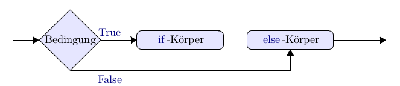

# Control Flow (Part 1)

Beim Programmieren tritt häufig der Fall auf, dass Teile des Codes nur unter einer gewissen Bedingung ausgeführt werden sollen.

Bedingungen werden über Boolsche Variablen abgefragt, also `True` und `False`.

In vielen anderen Programmiersprachen wird Code mit Klammern strukturiert - in Python allerdings funktioniert die Struktur über **Einrückungen von Blöcken**.

## Blöcke

    ....                                   
    ....                                   
       .......                            
       .......    Diese vier Zeilen       
       .......    bilden einen Block      
       .......
    ...
    ...

Auch die ganzen acht Zeilen bilden einen Block, in dem eben der kleiner
Block enthalten ist. Einrücken funktioniert **entweder mit der
Tabulator-Taste oder mit Leerzeichen.** Beide Methoden zu mischen ist eine schlechte Idee, das kann zu Problemen führen.

## Coder unter Bedingungen ausführen

### if

Wenn Sie eine Folge von Befehlen nur dann ausführen wollen, wenn eine
gewisse Bedingung erfüllt ist, so geht das so:

'''
alter = 300

if alter > 120: #Doppelpunkt beachten!
    print("Da stimmte was nicht, so alt kann man nicht werden.")

print("I'm a lumberjack and I'm OK.")   # Das steht wieder im Hauptblock und wird immer durchgeführt.
'''

Beachten Sie die Syntax: Nach 'if  Bedingung' **steht ein Doppelpunkt.** Danach kommt ein
eingerückter Block.

Der Programmfluss für ein 'if' lässt sich so veranschaulichen:

</img>

### if ... else

Wenn eine Bedingung erfüllt ist, soll etwas getan werden, andernfalls etwas anderes.

'''
alter = 50

if alter > 120:
    print("Da stimmt was nicht, so alt kann man nicht werden.")
else:
    print("Gratuliere zum "+str(alter)+ ". Geburtstag")
    print("Wie geht's?")

print("I'm a lumberjack an I'm OK.")   # Das steht wieder im Hauptblock.
'''

Der Programmfluss für ein 'if ... else' lässt sich so veranschaulichen:

 </img>

### if .. elif .. else

Häufig will man alternative Bedingungen verwenden: Wenn etwas der Fall ist, tu dies, wenn etwas anderes
der Fall ist, das, sonst jenes.  'wenn etwas anderes der Fall ist'  wird in Python durch 'elif' wiedergegeben. Es können beliebig viele solcher 'elif'-Fälle stehen, bevor der 'else'-Fall kommt.       

Nach dem Doppelpunkt beginnt in der nächsten Zeile jeweils ein tiefer
eingerückter Block. Genau dieser Block wird ausgeführt, wenn die
Bedingung vor dem Doppelpunkt erfüllt ist.

'''
alter = 115

if alter > 120:
    print("Da stimmt was nicht, so alt kann man nicht werden.")
elif alter > 115:
    print("Sind Sie sicher ? Sie wären dann der älteste Mensch.")
elif alter > 100:
    print("Gratuliere!")
    print(str(alter)+" Jahre ist ein biblisches Alter")
else:
    print("Gratuliere zum "+str(alter)+ ". Geburtstag")
'''

Der Programmfluss sieht so aus:

</img>

### Unterfälle

In einem Block kann wieder eine Fallunterscheidung stehen, also beispielsweise:

'''
alter = 22

if alter > 120:
    print("Da stimmt was nicht, so alt kann man nicht werden.")
else:
    print("Gratuliere zum "+str(alter)+ ". Geburtstag")
    print("Wie geht's?")
    print("Übrigens ...")
    if alter%2 == 0:
        print("Dein Alter ist gerade.")
    else:
        print("Dein Alter ist ungerade.")
'''

### while-Schleifen

Man kann einen Programmblock so lange durchführen, wie eine gewisse Bedingung erfüllt ist, dann
mit dem weiteren Programm fortfahren.

'''
n=int(input("Geben Sie eine nat. Zahl groesser als 0 ein: "))

while n%2 == 0:
    n = n//2
    print("n halbiert")
    print("Ergebnis: ", n)
'''

Das Flussdiagramm sieht so aus:

</img>

Da in diesem Diagramm ein eine Schleife (loop) vorkommt, nennt man dieses Konstrukt 'while-Schleife'.

## Operationen mit Bedingungen / Boolschen Variablen

Für Wahrheitswerte sind die *Rechenoperationen* die logischen Operationen: `and`, `or`, `not`.

Man spricht in diesem Zusammenhang von einer Bool'schen Algebra.  Es gibt für `and` und `or` zwei Distributivgesetze, und für den Zusammenhang zwischen `not` und `und`, bzw. `or` die de Morgan'schen Regeln.

Das logische `und` muss nicht erklärt werden, das logische `oder` kann aber zu Missverständnissen führen: Es schließt den Fall, dass beide Seiten wahr sind, mit ein, ist also kein 'entweder ... oder'.

'''
True and False
'''

### Vergleiche

Durch `==` kann man prüfen, ob zwei Werte gleich sind, das Ergebnis ist `True`, wenn sie es sind, sonst `False`.

**Achtung**: Hier stehen **zwei Gleichheitszeichen!** Ein Gleichheitszeichen wird nur Zuweisungen von Variablen verwendet.

''' 1 == 1 '''

## Spezielle Anweisungen in Blocks

### break und continue

Manchmal ist es wichtig, zur nächsten 'Runde' der Schleife zu springen, das geschieht mit der Anweisung `continue`. In anderen Fällen wollen wir eine Schleife abbrechen, das geschieht mit der Anweisung `break`. Das Programm fährt
dann mit dem Code nach der while-Schleife fort.

'''
# Was tut dieses Programm ?

i = 0
while i < 10:
    s = input('Sagen Sie was! ')
    i = i+1
    if s == 'weiter':
        continue
    if s == 'fertig':
        break
    print('Sie haben "', s, '" gesagt.')

print("Jetzt ist's vorbei.")
'''
