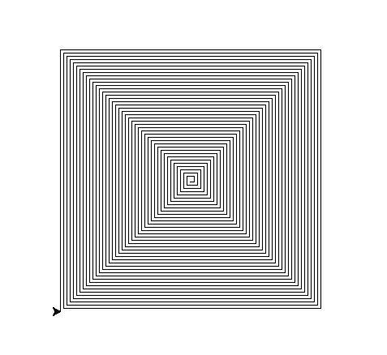

# 1. Übung

Zahlen, Strings, Bedingungen, while-Schleifen

Hausaufgabe: Löse mindestens 6 der folgenden Aufgaben. Ihr dürft die Aufgaben in Gruppen bearbeiten.

Abgabe im ISIS-Kurs, spätestes Abgabedatum wird dort angegeben, Gruppenpartner bitte bei der Abgabe vermerken.

Für einige Aufgaben benötigt ihr Zufallszahlen. Für Fließkomma-Zufallszahlen
zwischen 0 und 1 können Sie die Funktion `random` des Moduls `random` benutzen oder die Funktion `rand` des Moduls `numpy.random`.
Für ganze Zufallszahlen gibt es in den beiden Modulen eine Funktion `randint` (mit kleinen Unterschieden, sehen Sie sich `help(...)` an!).


```python
import random  #importiert random - ab jetzt könnt ihr das Modul im ganzen Notebook aufrufen!
help(random.random)  #gibt aus, was die Funktion random des moduls random tut

import math
help(math.sqrt)
```

## Leichtere Aufgaben

### 1. Fakultät berechnen
Schreibe ein Programm, das eine natürliche Zahl einliest und deren Fakultät ausgibt.

### 2. Primzahltest
Schreibe ein Programm, das eine natürliche Zahl einliest und prüft, ob es sich um eine Primzahl handelt.

### 3. Quersumme
Schreibe ein Programm, das als Eingabe eine ganze Zahl erwartet und die Quersumme ausgibt.

### 4. Regelmäßiges Polygon
Schreibe ein Programm, das um Eingabe einer (natürlichen) Zahl n bittet und anschließend  mit der Turtle-Graphik ein n-Eck zeichnet.

### 5. Harshad-Zahlen
Eine naürliche Zahl heißt Harshad-Zahl, wenn sie durch ihre Quersumme bezüglich der Dezimalschreibweise) teilbar ist. Beispielsweise ist für $$777$$ die Quersumme $$7+7+7=21$$ und teilt $$777$$.

Schreibe ein Programm, dass die Harshard-Zahlen von 1 bis 100 berechnet.

### 6. Palindrom
Schreibe ein Programm, das einen String einliest und prüft, ob es sich um ein Palindrom handelt.

### 7. Spiralornament

Zeichne mit der Turtle ein spiralartiges Ornament




## Mittelschwere Aufgaben

### 8. Pi durch Zufallszahlen

Wir betrachten ein Quadrat der Seitenlänge 2 und setzen zufällig einen Punkt auf das Papier. Wie wahrscheinlich ist es, dass ein Punkt weniger als Abstand 1 zum Mittelpunkt hat? Hinweis: hier sind die Module `random` und `math` sehr hilfreich.

Wie lässt sich daraus $\pi$ berechnen? Starthilfe von Daniel Shiffman: https://youtu.be/5cNnf_7e92Q?t=99

### 9. Random Walk

Simuliere mit Hilfe der Turtlegraphik ein Wesen, dass im Ursprung startet und in jedem Zeitschritt mit Wahrscheinlichkeit 1/4
nach N/W/S/O läuft (eine gewisse Strecke s). Beende die Simulation, wenn das Wesen wieder im Ursprung ist.


Hast du Vermutungen darüber, mit welcher Wahrscheinlichkeit das Wesen überhaupt zurückkehrt oder über die mittlere Dauer der Irrfahrt?  Wie lassen sich solche Hypothesen mit einer Simulation auf Plausibilität überprüfen? (Beweisen könnten lässt sich das allerdings nur mit Hilfe von Mathematik.)

### 10. Pseudozufallszahlen
Wenn man in Programmen Zufallszahlen benötigt, so werden meist Folgen von Pseudozufallszahlen verwendet, d.h. eine Folge von Zahlen $a_1, a_2, a_3, \ldots$, die für statistische Analysen wie das Ergebnis eines Zufallsprozesses aussehen. Ein einfaches Beispiel solcher Pseudozufallfolgen mit Folgegliedern aus dem Bereich von 0 bis 65535 erhält man durch

$$a_{i+1} = (25173 \, a_i + 13849) \% 65536$$.

(Dies ist eine übliche Weise für die Definition von Zahlenfolgen: Die Gleichung gibt an, wie man aus einem Folgeglied $a_i$ das nächste Folgeglied $a_{i+1}$ errechnet.) Schreibe ein Programm, das das erste Folgeglied (den **seed**)
vom Nutzer einliest und die nächsten 20 Folgegliedeausgibt.

*Zusatz*: Veranschauliche die Zufallszahlen, indem du durch diese Zahlen die Bewegung einer `turtle` steuerst. Dafür gibt es verschiedene Möglichkeiten. Wenn das Ergebnis schön wirr aussieht, scheint der Zufall zufällig genug zu sein.

#### 11. Häufigkeit der Vokale

Schreibe ein Programm, das für einen String (also Text) die Anzahl der 'e','a','i','o' und 'u' ermittelt.
Man kann statt eines eingegebenen Strings auch einen ganzen Text verwenden.  Kopiere dazu den Text
als Datei (auf ISIS/GitHub stehen als Beispiele *das\_urteil.txt* und *dickens\_martinchuzzlewit.txt*) in das Verzeichnis, wo sich das Programm befindet.

Daran lässt sich die Sprache erkennen, probier es aus!


```python
with open("das_urteil.txt","r") as f:
    text=f.read()
```

#### 12. Buchstaben zu Bild
Schreibe ein Programm, das um die Eingabe einer Zeichenkette aus den Buchstaben 'L','R' und 'G' bittet. Anschließend zeichnet die Turtle-Graphik die Kurve, die durch die Anweisungen 'L' (nach links drehen), 'R' (nach rechts drehen) und 'G' (50 Schritte geradeaus gehen) gegeben ist, also liefert beispielsweise GLGLGLG ein Quadrat.

#### 13. Stern
Schreibe ein Programm, das um Eingabe einer Zahl n bittet und anschließend mithilfe der Turtle-Grafik einen n-zackigen Stern zeichnet.


#### 14. Mäander
Schreibe ein Programm, das nach Eingabe einer Zahl n ein n-fach wiederholtes Mäander-Ornament zeichnet, siehe: https://de.wikipedia.org/wiki/Mäander_(Ornamentik)

#### 15. Eine quadratische Gleichung
Schreibe ein Programm, das die Koeffizienten $a$,$b$,$c$ einer
quadratischen Gleichung $ax^2+bx+c=0$ einliest und die reelle(n) Lösung(en) ausgibt,
bzw. gegebenenfalls eine Meldung, dass es keine reelle Lösung gibt.  
Schreibe eine Variante, die die komplexen Lösungen ausgibt. In beiden Fällen braucht man die Wurzelfunktion `sqrt(x)`, die man entwerder aus `numpy` oder `math` importieren kann.


### Schwere Aufgaben

#### 16. Collatz-Folge
Die Collatz-Folge $(a_n)_{n \in N}$ zum Anfangswert $a_0\in N$ ist wie folgt rekursiv definiert: Ist $a_n$ gerade, so ist $a_{n+1}=\frac{a_n}{2}$, andernfalls $a_{n+1}=3 a_n+1$.  Es ist nicht bekannt, ob diese Folge für alle Anfangswerte irgendwann bei $1$ ankommt (und anschließend periodische weitergeht $1\rightarrow 4 \rightarrow 2 \rightarrow 1 \rightarrow \cdots$.)

Schreibe ein Programm, dass für einen eingebenen Anfangswerd die ersten 100 Folgenglieder ausgibt. Schreibe anschließend eine Variante, die alle Glieder bis zur ersten $1$ und den Index dieser ersten $1$ ausgibt. Schreibe anschließend ein Programm, das im Zahlenbereich bis zu 1 Million (oder gerne auch größer) den Anfangswert mit dem längsten Anfangsstück bis zur ersten $1$ ausgibt.

#### 17. Verschlüsselung mit Caesarchiffre

Bei der Caesarchiffre, einem einfachen Verfahren zur Verschlüsselung von Nachrichten, ersetzt man die Buchstaben mit dem $n$. Nachfolger im Alphabet (zyklisch), also z.B. f"ur $n = 3$ wird a zu d, b zu e, c zu f, ..., w zu z, x zu a, y zu b und z zu c. Aus **eswarschondunkel** wird dann **hvzduvfkrqgxqnho**.
Traditionell verwendet man bei den einfachen Verschlüsselungen keine Groß-/Kleinschreibung, Interpunktion und Leerzeichen -- das Knacken des Codes wäre sonst zu einfach. Ebenso können hier Umlaute und ß besser als ae, oe, ue und ss dargestellt werden.

Schreibe ein Programm, das ein $n$ und den zu verschlüsselnden Klartext einliest und dafür die verschlüsselte Zeichenkette ausgibt.

#### 18. Genomanalyse (zählt doppelt)
Lese mit dem folgenden Stück Code die ganze Datei *protein_ecoli.txt* in einen String. Es handelt sich um den Teil der DNA von E. Coli, der das erste Protein (bezüglich einer in den großen Gendatenbanken festgelegten Reihenfolge) codiert.

Schreibe ein kleines Programm, das das längste Code-Stück sucht, das (überschneidungsfrei) doppelt in dieser Sequenz vorkommt (oder alle längsten Stücke).


```python
%ls *.txt #dieser Befehl wird in der Konsole ausgeführt. Hier sollte die datei "pritein_exoli.txt" auftauchen
```


```python
f = open("protein_ecoli.txt", "r")
seq = ""

for line in f:
    seq = seq + line.rstrip()
f.close()
```


```python

```
