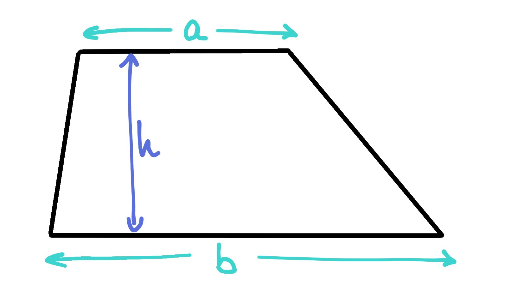
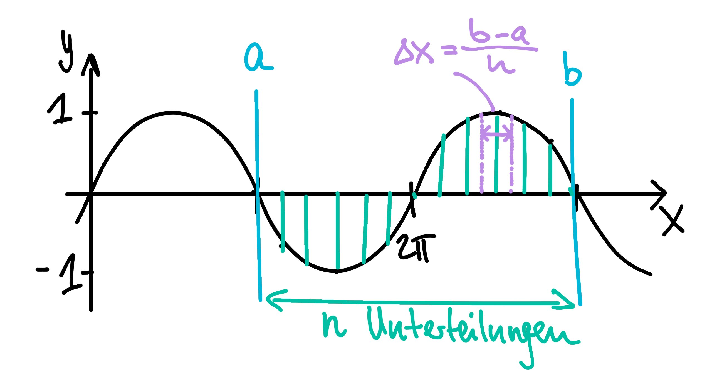

# Funktionen

## Grundlagen

In Python kann man selbst Funktionen definieren. Das geht so:

```python
def division(x, y):
    '''Liefert x/y, falls y != 0
    '''
    if y != 0:  
        return x/y
    else:
        print("Fehler. Division durch Null")
```

Mit `return ...` wird die Größe definiert, die anschließend als Wert der Funktion zurückgegeben wird. Wird kein Rückgabewert bei `return`definiert, wie das in der `else` Abfrage geschieht, wird der Wert `None` zurückgegeben.

Die Beschreibung in dreifachen Anführungszeichen wird als Doc-String bezeichnet und wird angezeigt, wenn man `help(f)` eingibt.


## Lokale und globale Variablen

Gewisse Funktionen in Python sollen **immer verfügbar** sein, z.B. `id()` oder `type()`. Diese Funktionen sind im **built-in namespace** zu finden. Variablen die **innerhalb des "Hauptkörpers"** des Programms definiert werden gehören zum **global namespace**. Alle Variablen, die **in einer Funktion** verändert oder zugewiesen werden, sind Teil des **local namespace**.

```python
konstante = 42  #Variable "konstante" im global namespace

def f(x):
    konstante = 1 #Variable "konstante" im local namespace
    y = konstante*x
    return y
```

Das Ergebnis von `f(1)` ist `1`, da die der Wert der lokalen `konstante` eins ist.
Dabei wir die Variable `konstante` die vor der Funktionsdefinition steht nie verändert!


Im Folgenden Beispiel wird die Variable aus dem globalen Namenstraum innerhalb der Funktion benutzt.

```python
konstante = 42

def f(x):
    global konstante
    y = x*konstante
    konstante =1
    return y

f(1)
```


## Argumente

### Übergabe durch Position

**Beispiel:** Berechnung der Fläche eines Trapezes.




```python
def trapez(a, b, h):
    '''berechnet Fläche eines Trapezes
    Parameter a,b,h'''
    return h*(a+b)/2
```

In der Funktion spielen `a`, `b` und `h` verschiedene Rollen. Wenn ich
`f(1,2,5)` aufrufe, sollte ich wissen, dass 1 für `a`, 2 für `b` und 5 für `h`
eingesetzt wird.

### Übergabe durch Schlüsselwort (keyword)

Es ist aber auch möglich, Funktionen so zu deklarieren, dass die Argumente mit Schlüsselwörtern übergeben werden können.
```python
def funktion(argument1=default1, argument2=default2,...):
    return 0
```
Dabei muss jeweils ein Defaultwert angegeben werden, der für das Argument einsetzt wird, wenn nichts zu diesem Schlüsselwort übergeben wurde.

Man kann auch in diesem Fall noch die Argumente ohne Schlüsselwort übergeben. Sie werden dann in der Reihenfolge den Argumentvariablen zugeordnet, in der sie in der Deklaration stehen.


```python
def trapez(a=1, b=1, h=1):
    '''brerechnet Fläche eines Trapezes
    Parameter a,b,h'''
    return h*(b+a)/2
```

#### Ein  weiteres Beispiel: Funktion für numerische Integration

Das ist eine Funktion, die eine übergebene Funktion numerisch integriert. (Zugrunde liegt eine so genannte Quadraturformel, genauer eine der einfachsten, die Trapezregel.)



$\int^b_a f(x) \approx \sum^n_{i=0} f(a + i \, \Delta x) \Delta x - f(a)\frac{1}{2}\Delta x - f(b) \frac{1}{2} \Delta x $


```python
import numpy as np

def integral(f, a, b, n):
    '''Approximiert das Integral über die Funktion f von a bis b nach der Trapezregel
    mit n Unterteilungen'''
    x = np.linspace(a, b, n+1) #erzeugt ein Array mit gleichmäßigen Abständen in einem Intervall
    return (np.sum(f(x)) -0.5*f(a) - 0.5*f(b)) * (b-a)/n
```


```python
integral(np.sin, 0, 2*np.pi, 100)
```


```python
integral(np.sin, 0, 2*np.pi, 1000)
```

Es ist aber - gerade bei Funktionen mit vielen Argumenten - praktisch, sich nicht deren Reihenfolge, sondern deren hoffentlich sprechende Namen merken zu müssen. Man könnte die Funktion also so deklarieren:


```python
def integral(f=np.sin, a=0, b=1, n=1000):
    '''Approximiert das Integral über f von a bis b nach der Trapezregel
    mit n Unterteilungen'''
    x = np.linspace(a, b, n+1)
    return (np.sum(f(x)) -0.5*f(a) - 0.5*f(b)) * (b-a)/n
```

Diese Funktion kann ich immer noch so wie die vorige aufrufen. `integral(np.sin,0,2*np.pi,1000)` wird weiterhin die Variablen in der gegebenen Reihenfolge ersetzen.

Die Argumente lassen sich aber auch so übergeben: `f(f=np.cos,a=1,b=5,n=50)`. Hier werden die Variablen gemäß ihrer Namen
(keywords) mit Werten gefüllt. Es ist aber insbesondere auch möglich manche dieser Argumente wegzulassen. Diese erhalten dann den default-Wert, der in der Definition steht. `f(np.sin,0,2)` verwendet also für $n$ den Defaultwert 1000.


```python
integral(f=np.cos, a=0, b=0.5*np.pi)
```

### Mischung der beiden Formen: Positionsargumente und Schlüsselwörter


```python
def funktion(arg1, arg2,... , kwarg1=default1, kwarg2=default2):
  return 0
```

Beispiel: Eine Funktion, die eine übergebene Funktion numerisch integriert.


$\int^b_a f(x) \approx \sum^n_{i=0} f(a + i \, \Delta x) \Delta x - f(a)\frac{1}{2}\Delta x - f(b) \frac{1}{2} \Delta x $

```python
def integral(f, a, b, n=1000):
    '''Approximiert das Integral über f von a bis b nach der Trapezregel
    mit n Unterteilungen'''
    x = np.linspace(a, b, n+1)
    return (np.sum(f(x)) -0.5*f(a) - 0.5*f(b)) * (b-a)/n
```

#### das geht nur in Python 3: Obligatorische Schlüsselwortargumente ohne Default-Wert

Bei den oben skizzierten Varianten der Übergabe von Argumenteen wurden diese entweder *ohne Default-Wert* nach ihrer Position übergeben oder *mit Default-Werten* über Schlüsselwörter. Es könnte aber wünschenswert sein, Argumente ohne Default-Wert über Schlüsselwörter zu übergeben.

Argumente ohne Default-Wert müssen tatsächlich übergeben werden, man kann sie nicht weglassen. In Python 3 geht das so:

    def f(a,*,b,c=3):
       print("a: ",a)
       print("b: ",b)
       print("c: ",c)

**Alle Argumente nach dem \* müssen über ihr Schlüsselwort** übergeben werden. Dabei kann man die Argumente mit Default-Wert (hier c) weglassen, b aber kann man nicht weglassen. Also z. B.


```python
# Achtung! Nur Python 3

def integral(f, *, a, b, n=1000):
    '''Approximiert das Integral über f von a bis b nach der Trapezregel
    mit n Unterteilungen'''
    x = np.linspace(a, b, n+1)
    return (-0.5*f(a)-0.5*f(b)+np.sum(f(x)))*(b-a)/n
```


```python
integral(np.exp, a=1, b=2, n=1000)  # geht
```


```python
integral(np.exp, a=1, b=2) # geht auch
```


```python
integral(np.cos, 1, 2, 1000)  # Fehler
```

### Achtung: mutable und immutable

Wenn einer Funktion Argumente übergeben werden, so muss darauf geachtet werden, ob die Argumente **mutable** oder **immutable** sind.

Wenn **Zahlen, Strings, Tupel** und einige andere Typen übergeben werden, die **immutable** sind, so besteht **keine Gefahr die Originale aus Versehen zu verändern**.

Bei den **mutable-Typen Listen, Arrays, Mengen etc. dagegen ist das anders**. Sie werden als Referenzen ('call by reference') auf das veränderliche Original übergeben. Wenn also in der Funktion eine übergebene Liste verändert wird, verändert sich die ursprüngliche Liste.

Will man sicher sein, dass das nicht geschieht, müsst man selbst **eine Kopie des übergebenen Objekts anfertigen und nur noch damit arbeiten.** (Das entsprechende Verhalten nennt man im Zusammenhang anderer Programmiersprachen 'call by value').


```python
from copy import copy

def funktion1(x):
    '''erwartet eine Liste'''
    x.append(4)
    print("f1 durchgefuehrt")

def funktion2(x):
    '''erwartet eine Liste'''
    x[1] = 'Huhn'
    x = 3.33  # ab hier verliert 'x' die Verbindung
    # zum übergebenen Objekt x
    print("f2 durchgefuehrt")
    return x

def funktion3(x):
    '''erwartet eine Liste'''
    y = copy(x)
    y.append('asdf')
    print("f3 durchgefuehrt")
```


```python
l = [1, 2, 3]
lf = funktion1(l)
print(l)
print(lf)
```


```python
l = [1, 2, 3]
funktion2(l)
print(return_wert, l)
```


```python
l = [1, 2, 3]
funktion3(l)
print(l)
```

### Argumente ein- und auspacken (optional)

#### Durch  Position bestimmte Argumente: Listen und Tupel übergeben

Eine beliebige Zahl von durch ihre Position bestimmten Argumenten kann verpackt werden in ein Tupel (oder eine Liste), bzw. ausgepackt werden aus einem Tupel oder einer Liste.

Syntax bei der Funktionsdeklaration mit **Sternchen:**

```python
def f(*x):
    print("0. Arg: ", x[0])
    print("1. Arg: ", x[1])
    print("Rest: ", x[2:])
    print(type(x))
```


#### Durch Schlüsselwort bestimmte Argumente: Dictionaries übergeben

Eine beliebige Zahl von durch Schlüsselwort bestimmte Argumente kann in ein **Wörterbuch** verpackt, bzw. aus diesem ausgepackt werden.

Syntax bei der Funktionsdeklaration mit **zwei Sternchen:**

```python
def f(**x):
    print(x)

# Argumente werden in das Wörterbuch x verpackt
f(tag='Montag', anzahl=5, preis=3.8)
```


```python
def diskriminante(**x):
    '''berechnet die Diskriminante von a*x**2+b*x+c=0'''
    return x['b']**2-4*x['a']*x['c']

# Argumente werden in das Wörterbuch x verpackt
diskriminante(a=2, b=3.5, c=-4)
```

**Syntax beim Aufruf:**


```python
def g(a=1, b=2):
    print(a*b)


wb = {'a': 5, 'b': 17}
g(**wb)  # Wörterbuch wird beim Aufruf ausgepackt
```

### Kombination aller Arten von Argumenten (optional)

In Python-Lehrbüchern werden Positions-Argumente häufig mit `pargs`, die keyword-Argumente mit `kwargs` abgekürzt.

Man kann nun in einer **Funktionsdeklaration** einzelne Positionsargumente mit verpackten pargs und kwargs kombinieren:


```python
def f(a, b, *pargs, **kwargs):
    print(("a: ", a))
    print(("b: ", b))
    print(("pargs: ", pargs))
    print(type(pargs))
    print(("kwargs: ", kwargs))
    print(type(kwargs))

f(11, 2, 3, 4, x=3.14, y=0.0)
```

**Beachtedabei die Reihenfolge:** Einzelne Positionsargumente -- \*pargs -- \*\*kwargs.

Beim Aufruf sieht das so aus:

```python
def f(a, b, c, d, x=0.0, y=0.0):
    print(("a: ", a))
    print(("b: ", b))
    print(("c: ", c))
    print(("d: ", d))
    print(("x: ", x))
    print(("y: ", y))
    return a*b*c*d+x*y

liste = [2, 3]
woerterbuch = {'x': 10., 'y': 3.5}

f(1, 4, *liste, **woerterbuch)
```
