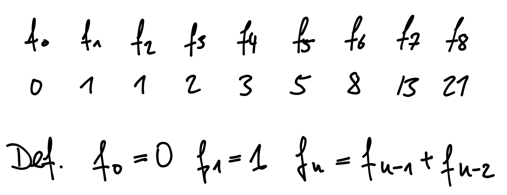
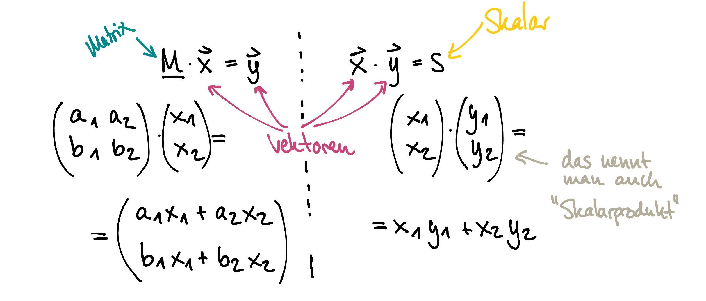
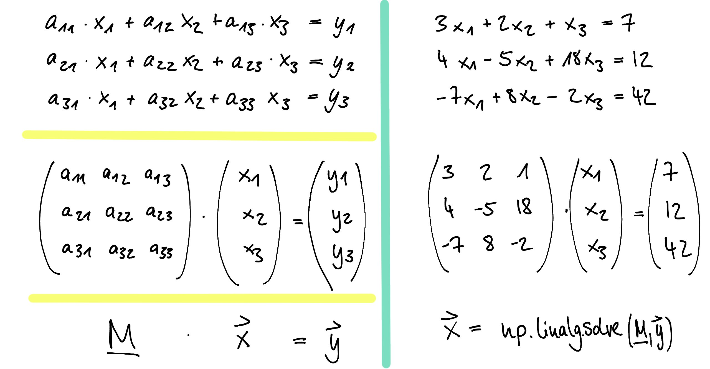

# Grundlagen

## Rekursion

Bei der [rekursiven Programmierung](https://de.wikipedia.org/wiki/Rekursive_Programmierung) ruft sich eine Prozedur, Funktion oder Methode in einem Computerprogramm selbst wieder auf. Es gibt viele Probleme, deren rekursive Formulierung besonders verständlich ist. Allerdings lässt sich, wer rekursiv programmiert, darauf ein, den genauen Ablauf der Ausführung schwer zu durchschauen.

Ein Beispiel hierfür sind die **[Fibonacci-Zahlen](https://de.wikipedia.org/wiki/Fibonacci-Folge)**.

Durch die "Rekursionsanker" f0 = 0, f1 = 1 kann die Fibonacci-Folge auch rekursiv in einer Funktion berechnet werden:

    def fib(n):
        if n == 0:
            return 0
        elif n == 1:
            return 1
        else:
            return fib(n-1) + fib(n-2)

Ruft eine Funktion sehr oft sich selbst auf, kann viel Speicherplatz verbraucht werden. Außerdem ist in Python eine maximale Rekursionstiefe (d.h. wie oft sich eine Funktion selbst aufrufen darf) eingestellt, die sich aber ändern lässt. Sie lässt sich auslesen mit `sys.getrecursionlimit()` und verändern mit `sys.setrecursionlimit()`.

Ein weiteres Beispiel ist die **[Drachenkurve](https://de.wikipedia.org/wiki/Drachenkurve)**

Eine anschauliche Methode, diese Kurve zu erzeugen, ist folgende:

Man nehme einen Papierstreifen und falte ihn in der Mitte, sodass sich seine Länge halbiert. Dies wiederhole man beliebig oft, dabei ist darauf zu achten, dass jedes Mal in dieselbe Richtung gefaltet wird. Zum Schluss falte man das Papier auseinander und ordne es so an, dass die Innenwinkel der Falze immer 90° betragen.

Diese Anleitung lässt sich ebenfalls rekursiv auffassen. Siehe dazu auch die Aufgabe in der Übung.

## [Lineare Algebra](https://de.wikipedia.org/wiki/Lineare_Algebra)

...  (auch **Vektoralgebra**) ist ein Teilgebiet der Mathematik, das sich mit Vektorräumen und linearen Abbildungen zwischen diesen beschäftigt. Dies schließt insbesondere auch die Betrachtung von linearen Gleichungssystemen und Matrizen mit ein.

Vektoren und Matrizen sind mehrere Zahlen, die in ein Format zusammengefasst werden: (x, y, z) kann z. B. Koordinaten der drei Raumachsen bezeichnen.
Matrizen haben mehr als eine Dimension. Es gibt auch Operationen zwischen Matrizen und Vektoren - etwa die Multiplikation:

$$ \left( \begin{matrix} 1 & 2 & 3 \\ 4 & 5 & 6 \\ 7 & 8 & 9 \end{matrix} \right) * \begin{pmatrix} x \\ y \\ z \end{pmatrix} =  \begin{pmatrix}  1 x + 2 y + 3 z \\  4 x + 5 y + 6 z \\ 7 x + 8 y + 8 z \end{pmatrix}  $$

Wie man hier schon erkennen kann, lassen sich damit besonders gut lineare Gleichungssysteme beschreiben. Es gibt aber auch verschiedene andere Anwendungen für Lineare Algebra, z. B. die Transformation (Drehung, Stauchung, ...) von Koordinaten in Räumen.

Hier ein paar Rechenbeispiele für eine Matrixmultiplikation und ein Lineares Gleichungssystem:

