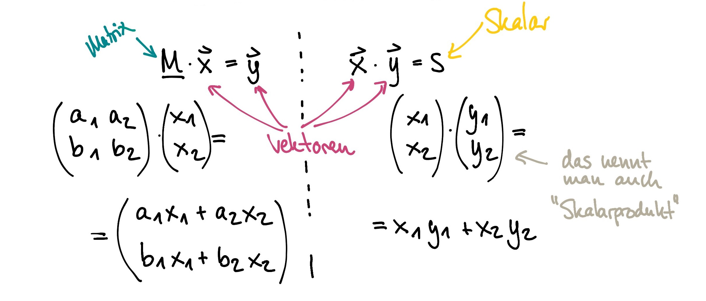
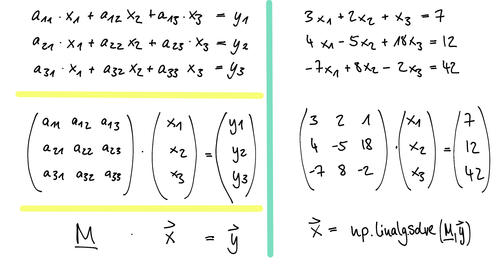

# Numpy & Matplotlib

**Numpy** ist eine Bibliothek, die eine einfache Handhabung von Vektoren, Matrizen oder generell großen mehrdimensionalen Arrays ermöglicht. Neben den Datenstrukturen bietet NumPy auch effizient implementierte Funktionen für numerische Berechnungen an.

**Matplotlib** erlaubt es mathematische Darstellungen aller Art anzufertigen.

## Numpy

### Zentrale Datenstruktur:  "array"

Ein Array kann auf verschiedene Art erzeugt werden, zum Beispiel mit der Funktion `array` aus einer Liste von Zahlen. Von anderen Arten wird gleich noch die Rede sein.

In der [Dokumentation](https://numpy.org/doc/stable/reference/generated/numpy.ndarray.html) findet ihr alle Attribute und Methoden, die ein Numpy Array hat.


Taken from [DataCamp CheatSheet](https://s3.amazonaws.com/assets.datacamp.com/blog_assets/Numpy_Python_Cheat_Sheet.pdf)


```python
import numpy as np
```


```python
v = np.array([1,2,3,4,5,6])

print(v)
print(type(v))
```

Ein **Array** ist eine Speicherstruktur, in der Zahlen (oder andere Objekte) in Abhängigkeit von einer gewissen Zahl von Indices gespeichert sind.

Eine Matrix als rechteckige Anordnung von Zahlen ist der Spezialfall eines Arrays mit zwei Indices.


```python
A = np.array([[1,2],[3,4]]) #2x2 Matrix aus verschachtelten Listen
print(A)
```

Allgemeiner ist ein Array dessen Einträge mit n Indices adressiert werden können, ein n-dimensionales Array.

Ist `A` ein solches Array, so liefert das Attribut (Achtung! keine runden Klammern, keine Funktion!)


```python
A.shape
```


ein Tupel, dessen Länge die Dimension des Arrays ist, die sich auch direkt mit `a.ndim` erfragen lässt.


```python
A.ndim
```

Auf die einzelnen Einträge lässt sich wieder mit Indizes zugreifen. Ein paar Beispiele:


```python
A[0] #wir nur ein Index angegeben, wird eine komplette Zeile ausgewählt
```


```python
A[0][1] # Um ein einzelnes Element zu erhalten müssen so viele Indizes wie Dimensionen angegeben werden - in diesem Fall 2
```


```python
A[0,1] #ist äquivalent zur oberen Abfrage
```

### Erzeugen von Arrays

Es gibt verschiedene Möglichkeiten ein Array zu erzeugen. Die Funktion `np.array` macht aus einer oder mehreren Listen ein Array.

Weitere praktische Möglichkeiten sind die folgenden:


```python
shape = (3,3)  # der Tupel shape wird im Folgenden benutzt um Numpy-Arrays zu erzeugen, die 3x3 Matrizen entsprechen
```


```python
np.zeros(shape) # erzeugt ein Array aus Nullen, dessen Shape durch das Tupel `shape` gegeben ist
```


```python
np.ones(shape)  # erzeugt ein Array aus Einsen, dessen Shape durch das Tupel `shape` gegeben ist
```


```python
np.zeros_like(A) # erzeugt ein Array aus Nullen mit der selben Shape wie A
```


```python
np.ones_like(A)  # erzeugt ein Array aus Einsen mit der selben Shape wie A
```

Neben den Varianten zur Erzeugung von Arrays, die nur aus Nullen oder Einsen bestehen, gibt es folgende Funktionen, die ein "vorgefülltes" Array erstellen:


```python
np.arange(10)  #erzeugt das Array mit Elementen 0...9
```

`np.linspace(anfang, ende, n)` erzeugt ein Array mit n Elementen und gleichen Abständen, das erste ist anfang, das letzte ist ende.


```python
np.linspace(0, 100, 11)
```

Möglichkeiten zur Füllung mit Zufallszahlen:


```python
np.random.rand(*shape)  # erzeugt eine Matrix der gegeben Shape,
                        # die mit gleichverteilten Zufallszahlen zwischen [0,1] gefüllt ist
```


```python
np.random.randn(*shape) # erzeugt eine Matrix der gegeben Shape,
                        # die mit Zufallszahlen aus der Gauß'schen Normalverteilung gefüllt ist
```

## Matplotlib (pyplot)


### klassische 2D Plots


```python
import matplotlib.pyplot as plt
%matplotlib inline

# try (after restart) %matplotlib inline
#                  or %matplotlib qt
#                  or %matplotlib notebook
```


```python
x = np.linspace(0, 10, 1000)
y = np.sin(x)   # in diesem Schritt wird die Sinusfunktion auf jedes einzelne Element des Arrays angewandt.
                # das geht zunächst nur mit 'universal functions' - eigene erstellt man mit numpy.vectorize

plt.figure()
plt.plot(x, y)
plt.show()
```

Bei den meisten graphischen "Backends" erscheint die Graphik erst beim Aufruf von `plt.show()` Vorher existiert sie nur als Datenstruktur.

In Jupyter-Notebooks entfällt show() meistens, da es automatisch aufgerufen wird.
Für eine interaktive Umgebung zur Datenanalyse (und zum Ausprobieren) ist das sinnvoll.


```python
x = np.linspace(0, 10, 100)
y = np.random.rand(100)  # das geht schief - die Arrays müssen immer gleich lang sein!
                        # Sonst ValueError("x and y must be the same size")

plt.figure()
#plt.plot(x, y)
plt.scatter(x, y, marker ="x", color = "black", label = "zufällige Datenpunkte")
plt.legend()
plt.show()
```

### Matrizen als Bilder darstellen

Eine 2D Matrix kann als Bild interpretiert werden. Die farbliche Darstellung kann über
[Colormaps](https://matplotlib.org/3.1.0/tutorials/colors/colormaps.html) definiert werden.

Hier wird eine Matrix aus Zufallszahlen erstellt und mit `plt.imshow()` visualisiert:


```python
M = np.random.rand(24,24)

plt.figure()
plt.imshow(M, cmap=plt.get_cmap('viridis'))
plt.show()
```

### Zugriff auf Teile des Arrays: slicing

Wie bei Listen und Strings ist Slicing eine wichtige Operation, die hier noch flexibler ist, denn man kann auch
mit einem Tupel (t1,t2,...,tk) für die entsprechende Dimension gerade die Einträge mit den Indices t1,...,tk auswählen.


```python
M = np.zeros((24,24))
```


```python
M[0] = 1
```


```python
M[0,0] = 0.5
```


```python
M[4] = 1
```


```python
M[:,1] = 1
```


```python
M[2,0::2] = 1
```


```python
M[10:15, 10:15] = 0.5
```


```python
plt.figure()
plt.imshow(M, cmap=plt.get_cmap('viridis'))
plt.show()
```

### Aus Arrays neue Arrays machen:      

Zwei Funktionen, mit denen aus bereits bestehenden Arrays neue gemacht werden können, sind `concatenate` und `reshape`.

`concatenate` fügt zwei Arrays hintereinander an

`reshape` transferiert die Einträge eines Arrays in eine neues Array mit anderer Shape


```python
v = np.arange(20)
v2 = np.concatenate((v, v))  # Aneinanderhängen zweier Vektoren
print(v2)
print(v2.shape)
```


```python
w = v.reshape((2, 10))  # beachtet: die neue Matrix wird zeilenweise befüllt
w
```

## Lineare Algebra

[Matrizenmultiplikation](https://de.wikipedia.org/wiki/Matrizenmultiplikation) ist die zentrale algebraische Operation für Matrizen.

Hier zwei Beispiele für die Multiplikation einer Matrix mit einem Vektor, die wiederum einen Vektor liefert und der Multiplikation zweier Vektoren, welche ein Skalar ergibt.



In `numpy` wird diese Operation mit `np.dot(M,x)` bzw. `M.dot(x)` durchgeführt.


```python
M = np.array([[1, 2], [3, 4]])
print(M)
```


```python
x = np.array([2,3])
x
```


```python
np.dot(M, x) # Matrix-Vektor-Produkt
```


```python
M.dot(x)  # alternative Schreibweise
```


```python
M@x # alternative Schreibweise
```


```python
x.dot(x) # Skalarprodukt mit sich selbst
```


```python
x@x   # alternative Schreibweise
```

**Transponieren** (Vertauschen von Zeilen und Spalten) geht nicht über eine Funktion, sondern über ein Attribut.

**Achtung!** Dieses legt kein neues Objekt im Speicher an, sondern nur eine anderen 'View' auf dasselbe Objekt. Wenn man also das Transponierte verändert, verändert sich das ursprüngliche Objekt auch. Alternativ mussen explizit mit `np.copy` eine Kopie angelegt werden.


```python
M.T  # transponieren
```


```python
M
```


```python
# M und M.T beziehen sich auf dasselbe Objekt im Speicher:
N = M.T
N[0,0] = 5  # verändert M und N
print(N)
print(M)
```


```python
# Diesmal wird M.T kopiert: N bezieht sich auf ein anderes Objekt im Speicher.
N = np.copy(M.T)
N[0, 0] = 6   # verändert nur N
print(N)
print(M)
```

Für weitergehende Operationen der linearen Algebra gibt es ein Unterpaket: `numpy.linalg`


```python
help(np.linalg)
```

Eine Funktion, die sehr wichtig ist, ist  `numpy.linalg.solve`. Sie löst ein lineares Gleichungssystem mit einer schnellen, in C programmierten Variante des Gauß'schen Algorithmus.

**An dieser Stelle noch ein paar Hinweise zu Linearen Gleichungssystemen**



```python
M = np.array([[3, 2, 1], [4, -5, 18], [-7, 8, -2]])
y = np.array([7, 12, 42])

print(M, y)
```


```python
x = np.linalg.solve(M, y)
print(x)
```


```python
# Probieren wir mal, wie lange ein 10000x10000-Gleichungssystem dauert
v = np.random.rand(10000)
```


```python
v[:100]
```


```python
A = np.random.rand(10000, 10000)
```


```python
A.shape
```


```python
v.shape
```


```python
%time np.linalg.solve(A, v)  #das dauert eine Weile ...
```

###  Kumulierende Funktionen

     numpy.sum(..., [axis=...])     summiert die Einträge, gegebenenfalls längs axis
     numpy.mean(..., [axis=...])    Mittelwert über die Einträge, ggf. längs axis
     numpy.std(..., [axis=...])     Standardabweichung ü.d. Einträge, ggf. längs axis

Dabei ist axis entweder eine Zahl oder ein Tupel, wenn über mehre Dimension summiert werden soll. Es gibt noch viel mehr solcher Funktionen, aber hier wird keine Vollständigkeit angestrebt.


```python
np.sum(A, axis=1)
```


```python
np.sum(A, axis=0)
```


```python
np.mean(A)
```


```python
np.mean(A, axis=1)
```

### Daten aus Tabelle lesen und darstellen

Da numpy unter anderem zur Datenverarbeitung gut ist, gibt es auch Funktionen, die beim Lesen von Daten helfen, etwa aus einer 'komma-separierten Liste' csv.

     np.genfromtxt(dateiname, [delimiter=...,[skip_header=...])


```python
%ls *.csv
```


```python
daten = np.genfromtxt("algebuei.csv", delimiter=";", skip_header=True)
```


```python
daten
```


```python
np.mean(daten, axis=0)
```


```python
plt.figure()
plt.hist(daten[:, 3], bins=50)
```


```python
plt.show() #das braucht ihr in einem "normalen" Python-Skript um den Plot anzuzeigen
```


```python
daten.shape
```

### 3D Plots

Man kann mit Matplotlib auch 3D Plots erstellen ...


```python
%matplotlib notebook
import matplotlib.pyplot as plt
import numpy as np
from mpl_toolkits.mplot3d import Axes3D
fig = plt.figure()
ax = fig.add_subplot(111, projection='3d')

x = np.linspace(-3, 3, 500)
y = np.linspace(-3, 3, 500)
xx, yy = np.meshgrid(x, y)
z = np.sin(xx*xx+yy*yy)
ax.plot_surface(xx, yy, z)
plt.show()
```

### Bilder einlesen


```python
import imageio
```


```python
bild = imageio.imread('images/IMGP2821.JPG', pilmode='F')
# tragen Sie doch hier den Namen eines Bildes ein, das sich im
# Verzeichnis befindet.
```


```python
bild.shape
```


```python
plt.figure()
plt.imshow(bild)
```


```python
plt.figure()
plt.imshow(bild, cmap=plt.get_cmap('gray'))
```


```python
a = np.abs(bild[10:, :]-bild[:-10])
# Was koennte diese Rechnung bewirken?
```


```python
plt.figure()
plt.imshow(a, cmap=plt.get_cmap('gray'))
```

### Schall und ein Beispiel für 'concatenate'


```python
from schallwerkzeuge import *
```


```python
y = recordsnd(None, 2)
```


```python
playsnd(y, RATE)
```


```python
plt.figure()
plt.plot(y)
plt.show()
```


```python
y.shape
```


```python
x = np.linspace(0, 2, 88200) #erzeugt eine Liste die dann Sekunden entspricht
```


```python
plt.figure()
plt.plot(x, y)
plt.show()
```


```python
y2 = y*np.sin(40*2*np.pi*x)
```


```python
playsnd(y2, RATE)
```


```python
playsnd(y[::-1], RATE) #reverse
```


```python
z = np.zeros(0)
for i in range(2):
    z = np.concatenate((z, y, y[::-1], y2))

playsnd(z, RATE)
```


```python
z = 0.5*(z+z[list(range(5000, z.shape[0]))+list(range(5000))])

playsnd(z, RATE)
```


```python

```
