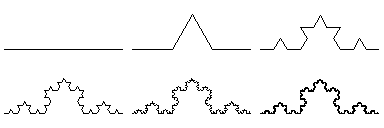
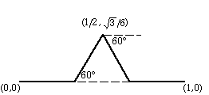
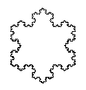
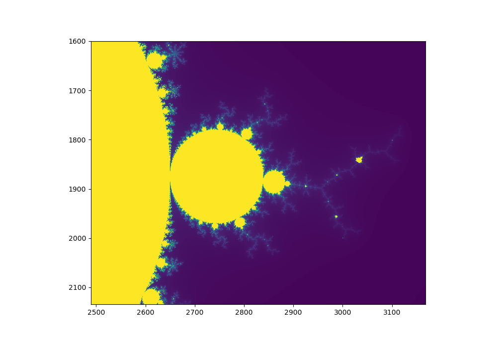

# 3. Übung

Funktionen, Rekursion, Numpy, Scipy, Matplotlib

Hausaufgabe: Löse mindestens 6 der folgenden Aufgaben. Ihr dürft die Aufgaben in Gruppen bearbeiten.

Abgabe im ISIS-Kurs, spätestes Abgabedatum wird dort angegeben, Gruppenpartner bitte bei der Abgabe vermerken.

## Einfachere Aufgaben

### 1. ggT

Schreiben Sie eine Funktion, die den größten gemeinsamen Teiler (ggT) zweier Zahlen rekursiv berechnet. Schlagen Sie dazu, wenn nötig, den "euklidischen Algorithmus" nach.

### 2. Minimum suchen

Schreibe eine Funktion `finde_minimum(f,x0,x1,feinheit=$0.01$)`.

Dabei ist `f` eine Funktion (die ein reelles Argument hat und eine reelle Zahl liefert), `x0` und `x1` sind die Ränder des Intervals, in dem wir ein Minimum suchen, `feinheit` die Feinheit der Unterteilung des Intervalls, die wir bei der Suche verwenden.

Testen Sie ihre Funktion an der Kosinus-Funktion im Intervall $[2,4]$.

### 3. Mittelwert und Standardabweichung

Schreibe eine Funktion, der eine Liste von Zahlen übergeben wird, und die daraus Mittelwert und Standardabweichung berechnet.


### 4. Zeichnen

Schreibe ein Programm, das mit Turtle-Graphik zeichnet.

Wenn man mit der Maus an eine Stelle klickt, soll sich die Turtle zur neuen Position begeben und dabei zeichnen.

Verwende dazu `screen=turtle.Screen()`, `screen.onclick(...)`,  `turtle.mainloop()`

Lese die Verwendung von 'onclick' in der Dokumentation nach.

Du kannst dir auch noch alle möglichen Erweiterungen ausdenken.

### 5. Winkel berechnen

Schreibe eine Funktion, die zwei n-dimensionale Vektoren als Argumente akzeptiert und den von den beiden Vektoren eingeschlossenen Winkel zurückgibt.

Schau dir dazu die Dokumentation des Pakets `numpy.linalg` an.

### 6. Gleichungssystem  lösen, I

Bestimme die Matrix der linearen Abbildung $\mathbb{R}^3\to \mathbb{R}^3$, die folgende Punkte aufeinander abbildet:

$$\begin{pmatrix} 1\\2\\3 \end{pmatrix} \rightarrow \begin{pmatrix} 2\\1\\1 \end{pmatrix} \quad, \quad
\begin{pmatrix} 1\\1\\0 \end{pmatrix} \rightarrow \begin{pmatrix} 1\\0\\0 \end{pmatrix} \quad, \quad
\begin{pmatrix} 0\\0\\-1 \end{pmatrix} \rightarrow \begin{pmatrix} 0\\-1\\-1 \end{pmatrix} \quad$$

Gesucht ist eine Matrix $M$, die folgende Bedingung für alle paare von Vektoren erfüllt:

$M v_1 = v_2$

## Mittelschwere Aufgaben

### 7. Gleichungssystem lösen, II

Erstelle für $n=2,3,4,10$ die Matrix 

$$M=(m_{ij})_{1\leq i,j\leq n}, \quad m_{i,j}=1/(i+j-1)$$.

Beachte, dass numpy-Arrays die Indizierung bei Null beginnen lassen, während sie hier mit 1 anfängt, wie es in der Mathematik oft üblich ist.

Löse das Gleichungssystem

$$M x = \begin{pmatrix} 1 \\ 1 \\ \ldots \\ 1 \end{pmatrix}$$.

Mache jeweils die Probe, um festzustellen, ob die Lösung tatsächlich eine ist. Was fällt auf für $n=10$?

### 8. Kochkurve

Die Kochkurve ist eine fraktale Kurve, die 1904 vom Schwedischen Mathematiker Helge von Koch eingeführt wurde.

Bei jedem Rekursionsschritt wird jede Strecke in drei Teile geteilt und die mittlere Teilstrecke durch zwei Strecken ersetzt, die im Winkel von $60^{\circ}$ anliegen.




Schreibe ein Programm, das eine Rekursionstiefe $n$ einliest (und eventuell noch eine Streckenlänge für den letzten Rekursionsschritt) und die sich ergebende Kochkurve mit der Turtlegrafik malt.

Aus Kochkurven kann man eine Schneeflocke zusammensetzen:



### 9. Karten mischen

Bestimme durch Simulation, mit welcher Wahrscheinlichkeit beim Mischen
eines Kartenstapels aus 52 Karten mindestens eine Karte an der alten Stelle zu liegen kommt.

Schreibe dazu eine Funktion  `ziehe(l)`, die ein zufälliges Element
der Liste `l` zurückgibt und dieses Element aus der Liste entfernt, eine Funktion `mische(n)`, die eine zufällige Anordnung der Zahlen $0,\ldots,n-1$ durch sukzessives Ziehen erzeugt und als Liste zurückgibt, eine Funktion `pruefe(l)`, die True zurückgibt, falls die übergebene Anornungs-Liste eine Karte an ihrer alten Stelle hat (d.h. falls es ein `i` gibt, so dass `l[i]==i`) und ein Hauptprogramm, das mit Hilfe der Funktionen `mische` und `pruefe` das gegebene Problem löst.

Für die Funktion `ziehe` können Sie `numpy.random.randint` benutzen.

Zusatzfrage: Können Sie die Antwort auch auf dem Papier bestimmen?

### 10. Drachenkurve

Schreibe ein Programm, das (mit Hilfe von Rekursion) die Drachenkurve zeichnet.

Man erhält die Kurve, indem man einen Papierstreifen einmal in der Mitte faltet, den gefalteten Streifen dann wieder in der Mitte faltet etc.  Faltet man den Streifen wieder so auseinander, dass an jeder Falz ein 90-Grad-Winkel besteht, bildet sich eine Kurve.

Beim Auffalten sieht man eine rekursive Struktur.  Eine Drachenkurve $n$-ter Ordnung erhaltet ihr, wenn ihr eine Drachenkurve $(n-1)$-ter Ordnung vorwärts lauft, dann rechts oder links abbiegt und eine Drachenkurve $(n-1)$-ter Ordnung rückwärts lauft. Diese Beschreibung ist zwar noch nicht vollständig (rechts oder links abbiegen?), aber rekursiv.

Die rekursive Funktion, die gesucht ist, müsste eine Funktion von zwei Argumenten sein, etwa `drache(n, vorwaerts)`. Dabei zeichnet `drache(n,True)` die Drachenkurve n-ter Ordnung vorwärts, `drache(n,False)` die Drachenkurve n-ter Ordnung rückwärts.  Beobachtet ihr nun genau das Auffalten des Papierstreifens, ist die rekursive Funktion fast fertig: Drachenkurve n. Ordnung vorwärts ist Drachenkurve n-1. Ordnung vorwärts, rechts  oder links abbiegen,  Drachenkurve n-1. Ordung rückwärts.

Du kannst dazu turtle-Graphik verwenden.

### 11. Kantenbild

Erzeuge aus einem Bild ein Schwarz-Weiß-Bild, das nur die Kanten des Bilds zeigt.

```python
bild = imageio.imread('images/IMGP2821.JPG', pilmode='F')
```

### 12. Schwerpunkt, Trägheitstensor

Schreibe eine Funktion, die eine Liste von Vektoren im $\mathbb{R}^3$ akzeptiert und daraus den Schwerpunkt und  den Trägheitstensor, sowie die Eigenvektoren des Trägheitstensors berechnet.

Zusatz (dann zählt die Aufgabe doppelt):  Visualisieren das Ergebnis.


### 13. Mikrozensus, I

Verwenden Sie die Mikrozensusdaten in der Datei `algebuei.csv` und lese mit Hilfe von`numpy.genfromtxt` in ein Array.

Erstelle ein Histogramm aller Einkommen, der Einkommen der Männer, der Einkommen der Frauen. Versuche, beide Histogramme in einer Graphik mit 'gestapelten Balken' anzuzeigen.

### 14. Mikrozensus, II

Bestimme den Mittelwert und den Median des Einkommens für jedes Bundesland.
Stelle die Ergebnisse in einer Graphik dar.

## (Sehr) schwere Aufgaben

### 15. Iris-Daten (zählt doppelt)

Lese die Daten in `iris.csv` in ein Array. Diese Daten sind gemessene Längen und  Breiten von Blütenblättern drei verschiedener Schwertlilienarten.

Stelle die Daten als 3d-Punktwolke bezüglich drei der vier Parameter dar, wobei die Farbe der Punkte die Art bezeichnen soll.  

### 16. Mandelbrot-Fraktal (zählt doppelt)
Die Mandelbrot-Menge ist ein vergleichsweise einfach zu generierendes Fraktal. Benannt ist es nach Bernoit Mandelbrot, der mit seiner Veröffentlichung *Les objets fractals, forme, hasard et dimension* (1975) den Begriff des Fraktals geprägt hat.

Die Menge lebt in der Komplexen Zahlenebene und wird durch folgende Vorschrift beschrieben:


$z_0 = 0 \quad$, $\quad z_{n+1} = z_n^2 + c $


Hier bei entspricht $c$ einem Punkt der komplexen Zahlenebene. Divergiert $z$ für $c$ nicht, gehört $c$ zur Menge. Für die Simulation lässt sich das vereinfachend durch einen fest gesetzen Maximalwert überprüfen.

Numpy Arrays dürfen auch Komplexe Zahlen enthalten, wenn das Array entsprechend initialisiert wird

`np.zeros((xres, yres), dtype=np.complex\textunderscore)`

Empfindliche Parameter sind die Pixeldichte (startet mit 200x200) und die Interationstiefe (erst mal begrenzen auf 200).

Oft wird das Fraktal in Farbverläufen dargestellt, indem man die Iterationstiefe auswertet die benötigt wird um den Maximalwert zu erreichen. Eine einfache Variante eine Matrix darzustellen ist `imshow(M)`. Will man eine Funktion generieren, die auf jedes Element eines Numpy-Arrays wirkt, empfiehlt es sich mit `np.vectorize` zu arbeiten.



Schafft ihr es, die Achenbeschriftung so anzupassen, dass sie zu den Werten der Komplexen Zahlen passt (anders als oben im Bild...) ?

In jedem Fall empfehlenswert: Auf Youtube nach "Mandelbrot Zoom" suchen.


### 17. Nim-Spiel (zählt doppelt)

Auf einem Tisch liegen drei Haufen von Hölzchen oder Steinchen:

    *    *****    *********    (1-5-9) .

Es spielen zwei Spieler A und B. A fängt an, sucht sich einen der Haufen aus und nimmt aus ihr so viele Hölzchen wie er/sie will, also beispielsweise alle 5 Hölzchen in der Mitte oder 3 von den 9 Hölzchen auf der rechten Seite. Anschließend ist B dran, sucht sich einen der verbliebenen Haufen und nimmt eine beliebige Zahl von Hölzchen.  usw. Gewonnen hat, wer das letzte Hölzchen nimmt.

Schreibe eine Funktion, die für das Spiel bestimmt, ob eine Position eine Siegposition ist, also von der aus sich durch das richtige Verhalten ein Sieg garantieren lässt. Schreibe dazu eine Funktion, die ermittelt, ob eine Position eine Verlustposition ist, also ob von dort jeder Zug zu einer Siegposition des Gegners führt. Außerdem ist die Position
(0,0,0) auf jeden Fall eine Verlustposition, denn diese bedeutet, dass der letzte Zug vom anderen Spieler gemacht wurde.

Verwende diese Funktionen, um ein Programm zu schreiben, das für eine Anfangskonfiguration einen Zug empfiehlt, der zum
Sieg führt, wenn es einen solchen gibt. Nützlich für die Programmierung wird es sein, noch eine weitere Funktion zu schreiben, die für eine gegebene Position die Liste der möglichen Züge, bzw. genauer der möglichen Positionen nach einem erlaubten Zug ausgibt.

Ziel der Aufgabe ist, ein Programm zu schreiben,  das bei einer gegebenen 'Position' (1-5-9 etwa) einen Zug empfiehlt, der zum  Sieg führt.


### 18. Fortsetzung der Wetterdatenaufgabe (zählt vierfach)

In der Aufgabe zu den Wetterdaten vom letzten Blatt sollten nur Eigenschaften der Temperaturdaten durch
geeignete Mittelwertbildungen (graphisch) erkennbar werden.

Eine systematischere Art, aus den Daten Informationen zu ziehen, ist ein *Regressionsmodell*. Die vorliegenden
Daten bilden eine Messreihe. In jeder Messung $i$ der Reihe wird (untere anderem) der Wert der Durchschnittstemperatur
`av_temps[i]` am Tag `dates[i]` ermittelt. Wir suchen ein Modell, dass aus dem Datum `dates[i]` die mittlere Temperatur
`av_temps[i]` voraussagt. Das geht natürlich nicht genau, aber wir können das Modell suchen, das den kleinsten Vorhersagefehler
macht. Bei der "klassischen" linearen Regression werden Modelle betrachtet, bei denen die Voraussage mit Hilfe linearer Funktionen gemacht und der Fehler durch die Summe der Quadrate der einzelnen Fehler gemessen wird.

Für unser Beispiel wollen wir ein lineares Regressionsmodell bauen, das einen Trend der Temperaturentwicklung unter den
jahreszeitlichen Schwankungen erkennt.

Wir bezeichen die Zielgröße `av_temps[i]` im weiteren
als `y[i]` und in das in Tage ab einem gewissen Stichdatum umgerechnete
Datum `matplotlib.dates.date2num(dates[i])` als `x_0[i]`.  Die (tropische)
Jahreslänge beträgt $d=365.24219052$ Tage.

Wir führen Größen `x_k[i]` ($k=1,\ldots,366$) ein, wobei `x_k[i]` den Wert 1 hat, wenn `dates[i]` auf den $k.$ Tag des Jahres fällt, sonst den Wert 0. (Durch `np.ceil(dates % d)` lässt sich das jeweilige $k$ ermitteln.)

Es sind nun Koeffizienten $b_0,\ldots, b_{366}$ so zu bestimmen, dass der quadratische Fehler

$\sum_i \left( \left(\sum_{k=0}^{366} b_k \ x_k[i] - y[i]\right) \right)^2 $


minimal wird.  $b_0$ ist als der langfristige Trend interpretierbar, die übrigen modellieren die jahreszeitliche Schwankung.

Wenn Sie in Linearer Algebra das kleinste-Quadrate-Problem schon behandelt haben, können Sie loslegen. Wenn nicht, ist folgende Information nützlich:

Sei $X$ die Matrix, deren Spalten die $x_0,\ldots,x_{366}$ sind und $b$ der (Spalten-) Vektor $b_0,\ldots, b_{366}$, so ist dasjenige $b$, das die Fehlerquadrate minimiert, durch

$b = (X^\top X)^{-1} X^\top y  \; $

bestimmt. Verwende `numpy` und speziell `numpy.linalg`.

Welcher Trend ist aus dem Ergebnis abzulesen (Temperaturveränderung/Jahr)? Das kann man natürlich auch für die Maximaltemperatur und  Minimaltemperatur machen.

Plotte außerdem die Koeffizienten $b[1],\ldots,b[366]$ und interpretiere den Plot.

<div class="iframe-container">
<iframe src="https://www.youtube.com/embed/6345NFxXTXE" allowfullscreen></iframe>
</div>
