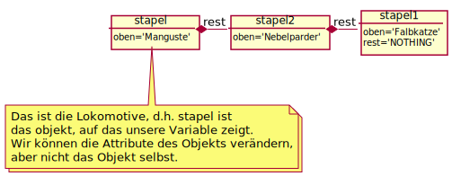
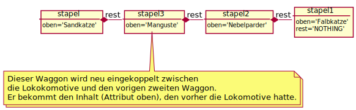

# Beispiele zu Klassen und mehr zu Special Methods

Hier werden einige (mehr oder weniger komplexe) Beispiele zu Klassen aufgeführt.

**Achtung:** Die Beispiele werden gegen Ende immer schwerer - ihr könnt auch später darauf zurückkommen wenn ihr sie nicht auf Anhieb versteht.

Mehr Infos zu den **Special Methods** findet ihr in den Beispielen 5 (operator overloading) und 6 (getitem & setitem)

Übersicht aller Beispiele:
1. Telefonbucheintrag
2. Ein Beispiel namens Bsp
3. Hello World, vielsprachig
4. Mulitagentensimulation: 'Lebewesen' in einer 'Welt' -- oder 'Himmelskörper'
5. Klasse für Bilder (_operator overloading_ )
6. Klasse für ein Buch (_getitem & setitem_ )
7. Stapel
8. Datenverarbeitungspipeline (Live Fourieranalyse des Mikrofon-Inputs)


### 1. Telefonbucheintrag

Telefonbucheintrag: Hier dient die Klasse/das Objekt nur zur Zusammenfassung verschiedener Eigenschaften. Das ließe sich mit einem Dictionary genauso machen, ist aber mit Klassen vermutlich doch lesbarer.


```python
class Telefonbucheintrag(object):
    name = ''
    vorname = ''
    tel_priv = []
    tel_arbeit = []
    tel_mobil = []


per1 = Telefonbucheintrag()
per1.name = 'Mustermann'
per1.vorname = 'Max'
per1.tel_arbeit = ['030/314-75820']
```

Einer der Gründe, selbst für so eine Aufgabe mit Klassen statt mit Dictionaries zu arbeiten, ist die
Möglichkeit, den Typ abzufragen, bzw. zu Prüfen, ob ein Objekt den Typ 'Telefonbucheintrag' hat:


```python
type(per1)
```


```python
isinstance(per1, Telefonbucheintrag)
```

### 2. Ein Beispiel namens Bsp

Ein ganz einfaches und sont sinnloses Beispiel, das dazu dient,
zu zeigen, wie Methoden
auf die Attribute der Instanz (über das Argument self)
und auf weitere der Methode übergebene Parameter zugreifen.


```python
class Bsp(object):
    x = 0

    def print_n_times(self, n):
        '''Gibt das Attribut x der Instanz n mal aus.'''
        for i in range(n):
            print(self.x)
```


```python
a = Bsp()
a.x = 5
a.print_n_times(6)
```

### 3.  Hello World, vielsprachig


```python
class HelloWorld():

    languages = ['de', 'en', 'fr', 'tk']
    messages = ['Hallo Welt!', "Hello World!",
                "Bonjour, le monde!", "Merhaba dünya!"]

    def __init__(self):
        '''legt English als Anfangssprache fest'''
        self.language = 'en'

    def set_language(self, la):
        '''stellt Sprache ein.
        Übergeben wird'''
        if la in self.languages:
            self.language = la
        else:
            # kleiner Vorgriff auf Fehlerbehandlung
            raise Exception(
                "Sprache nicht verfügbar. Verfügbar: "+' '.join(self.languages))

    def say(self):
        i = self.languages.index(self.language)
        print(self.messages[i])
```


```python
h = HelloWorld()
print(h.language)
```


```python
h.say()
```


```python
h.set_language('de')
```


```python
print(h.language)
```


```python
h.say()
```


```python
h.set_language('tk')
h.say()
```


```python
h.set_language('es')
```


```python
h.say()
```


### 4. Mulitagentensimulation:  'Lebewesen' in einer 'Welt'  -- oder 'Himmelskörper' (mittel schwer)


```python
import time
import numpy as np
import matplotlib.pyplot as plt
import matplotlib
matplotlib.use('TkAgg')


class World(object):
    '''Die Welt, in der die Wesen sozusagen leben.'''

    def __init__(self):
        self.wesen = None

    def populate(self, liste):
        '''Siedle die Wesen in der Welt an;
        jedes wesen merkt sich einen Verweis auf die Welt.'''
        self.wesen = liste
        for vieh in self.wesen:
            vieh.welt = self

    def step(self, dt=1):
        '''Ein Simulationsschritt, Zeit dt'''
        for vieh in self.wesen:
            vieh.berechne_kraft()
        for vieh in self.wesen:
            vieh.step(dt)


class Vieh(object):
    '''Ein Wesen, das Ort und Geschwindigkeit hat und auf das die anderen
    Wesen Anziehungs- und Abstoßungskräfe ausüben.'''

    def __init__(self, pos):
        self.pos = pos
        self.veloc = np.zeros(2)
        self.welt = None
        self.force_const1 = 1.
        self.force_const2 = 0.1

    def berechne_kraft(self):
        self.kraft = np.zeros(2)
        for vieh in self.welt.wesen:
            if not (vieh is self):
                self.kraft += self.force_const1*(vieh.pos-self.pos)/np.linalg.norm(vieh.pos-self.pos) +\
                    self.force_const2 / \
                    np.linalg.norm(vieh.pos-self.pos)**3*(self.pos-vieh.pos)

    def step(self, dt):
        '''Ein Bewegungsschritt'''
        self.veloc += self.kraft*dt/2.
        self.pos += self.veloc*dt
        self.veloc += self.kraft*dt/2.


class Viewer(object):
    '''Viewer object, dass die Simulation durchführt und anzeigt.'''

    def __init__(self, welt):
        self.welt = welt

    def simulate(self, N):
        l = len(self.welt.wesen)
        pos = np.array([vieh.pos for vieh in self.welt.wesen])
        p = {}
        plt.xlim(-3, 9)
        plt.ylim(-3, 9)
        for i in range(l):
            p[i], = plt.plot(pos[i, 0], pos[i, 1], 'o',
                             color=(i/l, (l-i)/l, ((l-i)/l)**2))

        plt.pause(0.1)
        for i in range(N):
            self.welt.step(0.1)
            pos = np.array([vieh.pos for vieh in self.welt.wesen])
            for i in range(l):
                # ,'o',color=(i/l,(l-i)/l,((l-i)/l)**2))
                p[i].set_data(pos[i, 0], pos[i, 1])

            plt.draw()
            plt.pause(0.01)  # plt.pause(0.1)
```


```python
# Das resultierende Programm sieht dann wie folgt aus:

v1 = Vieh(np.array([2., 3]))
v2 = Vieh(np.array([3., 5]))
v3 = Vieh(np.array([2., 1]))
v4 = Vieh(np.array([1., 1]))
w = World()
w.populate([v1, v2, v3, v4])
v = Viewer(w)
plt.ion()
v.simulate(300)
```


```python
plt.close('all')
```

## Special Methods: operator overloading

In der Deklaration von Klassen lassen sich "special methods" definieren, die aufgerufen werden, wenn man die Objekte dieser Klassen mit Rechenoperatoren `*,+,-,/, %,//`, etc. vernüpft. Außerdem lässt sich mit solchen Methoden entscheiden, wie das Objekt dargestellt wird, wenn man es (bei `print`) in einen String umwandelt oder in anderen Zusammenhängen als String repräsentiert.

### 5. Klasse für Bilder


```python
from imageio import imread
import matplotlib.pyplot as plt
%matplotlib inline


class Bild(object):
    '''Klasse für Bildobjekte, speichert die Bilddaten und
    Metadaten'''

    def __init__(self, daten=None, info=None):
        self.daten = daten
        if info:
            self.info = info
        else:
            self.info = ''

    def read_from_file(self, name):
        '''liest Bilddatei'''
        self.daten = imread(name, pilmode='F')
        self.info = "From file: " + name

    def __sub__(self, b):
        "definiert - für Bilder"
        return Bild(daten=self.daten-b.daten, info="Differenz von Bild1: "+self.info+"\nund Bild 2:"+b.info)

    def __add__(self, b):
        "definiert + für Bilder"
        return Bild(daten=self.daten+b.daten, info="Summe von Bild1: "+self.info+"\nund Bild 2:"+b.info)

    def __abs__(self):
        "definiert abs() für Bilder"
        return Bild(daten=np.absolute(self.daten), info="Betrag von Bild1: "+self.info)

    def __str__(self):
        return "Bild: "+str(self.daten.shape)+"\nInfos: "+str(self.info)

    def show(self):
        '''Anzeige'''
        plt.imshow(self.daten, cmap=plt.get_cmap('gray'))
        plt.show()
```


```python
bild = Bild()
bild.read_from_file('tu_berlin.jpg')
print(bild)
```


```python
bild.show()
```


```python
bild_links = Bild(
    bild.daten[:, :-1], info="linker Teil, rechte äußere Zeile weggelassen")
bild_rechts = Bild(
    bild.daten[:, 1:], info="rechter Teil, linke äußere Zeile weggelassen")
print(bild_links, "\n", bild_rechts)
```


```python
bild2 = bild_links-bild_rechts
```


```python
print(bild2)
```


```python
bild2.show()
```

## Special Methods: getitem, setitem

Anders als Sprachen, die in ihrer Architektur auf einer Klassenhierarchie aufbauen -- wie Java -- ist Python eine
Sprache, die so genannte "Protokolle" definiert. Jede Klasse, die gewisse Methoden hat, kann in gewissen
Kontexten verwendet werden. Das ist ein größeres Thema, das nur an einem sehr einfachen Beispiel erläutert sei.

Die folgende Klasse definiert eine `__getitem__` und eine `__setitem__` Methode. Daher kann man wie auf die
Elemente einer Liste mit eckigen Klammern auf die Rückgabewerte dieser Methoden zugreifen. Hier liegt aber
gar keine Liste vor, sondern alle Elemente werden als je eine Datei gespeichert.

### 6. Klasse für ein Buch


```python
class MyBook(object):

    def __init__(self,name):
        self.basename=name

    def __getitem__(self,position):
        if not isinstance(position, int):
            raise TypeError("Index must be an Integer")
        with open(self.basename+'%i.txt'%position, "r") as f:
            return f.read()

    def __setitem__(self,position,value):
        if not isinstance(position, int):
            raise TypeError("Index must be an Integer")
        with open(self.basename+'%i.txt'%position, "w") as f:
            f.write(value)
```


```python
book=MyBook('book_page_')
```


```python
book[0]='Maus'
book[1]='Katze'
book[2]='Schnabeligel'
```


```python
book[2]
```


```python
%ls *.txt
```


```python
%load book_page_2.txt
```

#### Wenn das geht, funktioniert dann eine for-Schleife ?


```python
for page in book:
    print(page)
```

Offenbar geht es gut, solange eine Datei existiert.  Jedes Objekt mit einer `__getitem__`-Methode erlaubt  eine for-Schleife. Man kann nachschlagen, dass die for-Schleife regulär beendet wird, wenn ein 'IndexError' auftritt.


```python
class MyBook(object):

    def __init__(self,name):
        self.basename=name

    def __len__(self):
        return 2

    def __getitem__(self,position):
        if not isinstance(position, int):
            raise TypeError("Index must be an Integer")
        try:
            with open(self.basename+'%i.txt'%position, "r") as f:
                return f.read()
        except:
            raise IndexError

    def __setitem__(self,position,value):
        if not isinstance(position, int):
            raise TypeError("Index must be an Integer")
        with open(self.basename+'%i.txt'%position, "w") as f:
            f.write(value)


```


```python
book=MyBook('book_page_')
for page in book:
    print(page)
```

for-Schleifen funktionieren aber auch noch unter ganz anderen Bedingungen, wenn nämlich das Objekt eine `__iter__`-Methode hat, die einen Iterator zurückgibt. Was das ist, soll hier nicht gesagt werden.

### 7. Ein Beispiel:  Stapel - LiFo (mittelschwer)

Wir wollen mit diesen Mitteln einen Stapel als verkettete Liste definieren, ohne auf den Python-Datentyp `list` zurückzugreifen. Der Stapel soll je eine Methode zum Ablegen und Nehmen eines Objekts haben. Das zuletzt abgelegte Objekt wird jeweils genommen: LiFo =  Last in First out.

Ein solcher Stapel lässt sich durch eine Kette von Objekten darstellen, die wie Eisenbahnwaggons aneinander hängen. Jeder Waggon besitzt einen Inhalt und  eine Vorrichtung zum Ankoppeln des nächsten Waggons besitzen.
Der vorderste Wagen sei, um im Gleichnis zu bleiben, ein Triebwagen oder eine Lokomotive. Der Inhalt der
Lokomotive sei das, was  oben auf dem Stapel liegt.

Legen wir Objekte auf dem Stapel ab,.

Ein leerer Stapel besteht aus einem einzigen Waggon, der keinen Inhalt hat und keinen angekoppelten
Wagen. Um das besser formulieren zu können, definieren wir ein besonders **NOTHING**-Objekt. (Wir könnten auch das Python-Objekt `None` nehmen, aber da dieses in Python an diversen Stellen vorkommt, könnte es zu Verwechslungen kommen.)


```python
class Nothing:
    pass

NOTHING = Nothing()

class Stapel(object):
    '''LiFo'''

    def __init__(self, oben=NOTHING, rest=NOTHING):
        self.oben = oben  # dieses Attribut zeigt auf das Objekt, das oben liegt
        self.rest = rest  # dieses Attribut zeigt auf den Reststapel
```

Wie können wir ein Objekt auf dem Stapel ablegen?

Dafür müssen wir einen Waggon zwischen die Lokomotive und den
ersten Wagen ankoppeln, d.h. ein neues Stapel-Objekt erzeugen,
bei dem `oben` auf das bisherige Attribut der Lokomotive verweist,
sowie `rest` auf den bisherigen Zug hinter der Lokomotive.
Die Lokomotive selbst erhält als `oben` das neu abgelegte Objekt.

Als Beispiel betrachten wir ist das Stapel-Objekt `stapel`:




Jetzt wollen wir das Objekt 'Sandkatze' ablegen, d.h. wir müssen dafür
sorgen, dass ein neuer Waggon `stapel3` (links) an stapel2 angehängt wird wird,
wobei `stapel3.oben`  den Wert 'Manguste' von `stapel.oben` übernimmt und
`stapel3.rest` auf`stapel2`, d.h. `stapel.rest`.




Und `stapel.rest` soll nun  `stapel3` sein.


```python
class Stapel(object):
    '''LiFo'''

    def __init__(self, oben=NOTHING, rest=NOTHING):
        self.oben = oben  # dieses Attribut zeigt auf das Objekt, das oben liegt
        self.rest = rest  # dieses Attribut zeigt auf den Reststapel

    def lege_ab(self, x):
        '''legt x oben auf den Stapel'''
        self.rest = Stapel(oben=self.oben, rest=self.rest)
        self.oben = x


```

Wie müsste nun die Methode `nimm` aussehen, die das oberste Element vom Stapel wegnimmt?

Schauen wir uns noch mal die eben betrachtete Beispielsituation an:


Wir müssen stapel2 aushängen. Was bedeutet das? Nach dem Abhängen soll `stapel`
als Attribut `oben` 'Nebelparder' haben, das Attribut `rest` soll auf `stapel1` verweisen


    ausgabewert = stapel.oben
    stapel2 = stapel.rest
    stapel.oben = stapel2.oben
    stapel.rest = stapel2.rest


```python
class Stapel(object):
    '''LiFo'''

    def __init__(self, oben=NOTHING, rest=NOTHING):
        self.oben = oben  # dieses Attribut zeigt auf das Objekt, das oben liegt
        self.rest = rest  # dieses Attribut zeigt auf den Reststapel

    def lege_ab(self, x):
        '''legt x oben auf den Stapel'''
        self.rest = Stapel(oben=self.oben, rest=self.rest)
        self.oben = x

    def nimm(self):
        wert = self.oben
        if wert == NOTHING:
            raise Exception("Stapel leer")
        else:
            try:
                self.oben = self.rest.oben
                self.rest = self.rest.rest
            except:
                self.oben = NOTHING
                self.rest = NOTHING
            return wert


```


```python
s = Stapel()
```


```python
s.lege_ab('Katze')
```


```python
s.lege_ab(3.1415)
```


```python
s.lege_ab('Spam Spam Spam')
```


```python
s.nimm()
```

Um ein weiteres Beispiel für **special methods** zu geben: Wenn wir
eine `__getitem__`-Methode implementieren, können wir wie bei Strings
oder Listen per  `[]` auf Elemente zugreifen und mit einer for-Schleife
iterieren.


```python
class Stapel(object):
    '''LiFo'''

    def __init__(self, oben=NOTHING, rest=NOTHING):
        self.oben = oben  # dieses Attribut zeigt auf das Objekt, das oben liegt
        self.rest = rest  # dieses Attribut zeigt auf den Reststapel

    def lege_ab(self, x):
        '''legt x oben auf den Stapel'''
        self.rest = Stapel(oben=self.oben, rest=self.rest)
        self.oben = x

    def nimm(self):
        wert = self.oben
        if wert == NOTHING:
            raise Exception("Stapel leer")
        else:
            try:
                self.oben = self.rest.oben
                self.rest = self.rest.rest
            except:
                self.oben = NOTHING
                self.rest = NOTHING
            return wert

    def __getitem__(self, ind):
        '''greift auf das Element des Stapels mit Index ind zu,
        Argument: ind (natürliche Zahl)

        ind == 0: zuletzt abgelegtes Element
        ind == 1: vorletztes Element, etc.
        '''
        i = 0
        a = self
        while i < ind:
            i += 1
            try:
                a = a.rest
            except:
                raise IndexError()

        try:
            oben = a.oben
        except:
            raise IndexError()

        if oben == NOTHING:
            raise IndexError()
        else:
            return oben
```


```python
s = Stapel()
s.lege_ab('Katze')
s.lege_ab(3.1415)
s.lege_ab('Spam Spam Spam')

for x in s:
    print(x)
```


```python
s = Stapel()
s.lege_ab('Katze')
s.lege_ab(3.1415)
s.lege_ab('Spam Spam Spam')

print(s[0])
```

### 8.  Ein wichtiger Anwendungsfall: Datenverarbeitungspipeline (schwierig)

Eine Datenverarbeitungspipeline.

Mikrophon ->  Fourieranalyse -> ... -> Anzeige

Jede Verarbeitungsstufe ist durch eine Klasse repräsentiert.
Die Objekte der Klassen kommunizieren über Queues (Warteschlangen),
die dafür sorgen, dass die Daten in der Reihenfolge ihrer Ankunft
bearbeitet werden und dass jeder Schritt auf die nächsten Daten wartet,
wenn noch keine da sind.

Alle Klassen haben eine Methode 'work'. Diese Methoden
laufen parallel (in verschiedenen Threads, aber auf demselben
Prozessor, also kein Geschwindigkeitsgewinn.)

Im folgenden wird ein einfaches Oszilloskop erzeugt.


```python
from __future__ import division
import pyaudio
from threading import Thread
import time
import matplotlib.pyplot as plt
import numpy as np
import queue

%matplotlib qt


# Audio - Parameter, je nach  Soundkarte andere RATE wählen

CHUNK = 2048
RATE = 44100
CHANNELS = 1

# Allgemeine Workerklasse, ließe sich als abstract base class definieren
# mit Hilfe des Moduls abc.


class Worker(object):
    '''Allgemeine Workerklasse. Hat eine in_queue und eine out_queue,
    die out_queue wird vom Konstruktor __init__ erzeugt, die in_queue
    kommt von außerhalb und wird durch connect_in angeschlossen.'''

    def __init__(self):
        self.out_queue = queue.Queue()
        self.in_queue = None
        self.STOP = False

    def connect_in(self, q):
        '''registriert connect_in als in_queue'''
        self.in_queue = q

    def work(self):
        '''tut nichts (könnte als abstractmethod deklariert werden).'''
        pass


class Source(Worker):
    '''Audio-Quelle, der Audio-Stream ruft alle CHUNK frames
    die  Methode micro_callback auf, die die Daten in die out_queue
    schreibt.
    '''

    p = pyaudio.PyAudio()

    def micro_callback(self, in_data, frame_count, time_info, status):
        '''callback Funktion: wird vom PyAudio-Objekt aufgerufen,
        wenn CHUNK Frames von der Soundkarte (Mikrophon) gelesen wurden'''
        # print "Micro"
        y = np.fromstring(in_data, dtype=np.short)
        if CHANNELS == 2:
            y = y.reshape((y.shape[0]//2, 2))
        else:
            y = y.reshape((y.shape[0], 1))

        self.out_queue.put(y)
        return (in_data, pyaudio.paContinue)

    def work(self):
        '''Startet den Audio-Aufnahme-Stream und registriert micro_callback
        als Callback-Funktion, die jeweils CHUNK Frames verarbeitet.'''
        # print "source"
        self.inStream = self.p.open(format=pyaudio.paInt16, channels=CHANNELS,
                                    rate=RATE, input=True, output=False, frames_per_buffer=CHUNK,
                                    stream_callback=self.micro_callback)
        self.inStream.start_stream()  # threading.Thread(target=stream).start()
        time.sleep(0.01)


class Analyser(Worker):
    '''Fourier-Analyse-Worker'''

    def work(self):
        '''führt Fourier-Analyse durch'''
        while not self.STOP:
            # print "Analyser"
            y = self.in_queue.get()
            y2 = np.abs(np.fft.fft(y, axis=0))
            self.out_queue.put(y2)


class Viewer(Worker):
    '''Anzeige-Worker'''

    def work(self):
        self.fig, self.ax = plt.subplots(1, 1)
        self.ax = plt.axes(ylim=(-1, 1), xlim=(0, CHUNK/RATE))
        self.xwerte = np.arange(CHUNK)/RATE

        self.kurve, = self.ax.plot(self.xwerte, np.zeros(CHUNK), lw=2)
        self.fig.canvas.draw()
        plt.pause(0.001)

        while not self.STOP:
            # print "Viewer"
            data = self.in_queue.get()
            self.kurve.set_data(self.xwerte, data/2**16)
            plt.pause(0.001)
            self.fig.canvas.flush_events()


source = Source()
analyser = Analyser()
analyser.connect_in(source.out_queue)
viewer = Viewer()
viewer.connect_in(analyser.out_queue)

# st=Thread(target=source.work)
# st.start()

source.work()
at = Thread(target=analyser.work)
at.start()
vt = Thread(target=viewer.work)
vt.start()

time.sleep(60)
viewer.STOP = True
analyser.STOP = True
source.inStream.stop_stream()
del(viewer)
plt.close('all')
```


```python

```
