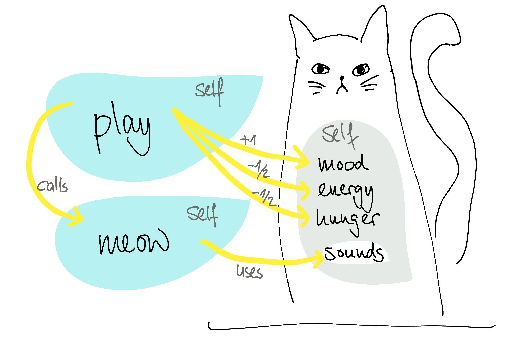

# Objektorientierte Programmierung (OOP)

[Alan Kay](https://de.wikipedia.org/wiki/Alan_Kay), der Erfinder der Programmiersprache Smalltalk und des Begriffs „object oriented“, definierte das [objektorientierte Programmieren](https://de.wikipedia.org/wiki/Objektorientierte_Programmierung) folgendermaßen:

1. Everything is an object
2. Objects communicate by sending and receiving messages (in terms of objects)
3. Objects have their own memory (in terms of objects)
4. Every object is an instance of a class (which must be an object)
5. The class holds the shared behavior for its instances (in the form of objects in a program list)
6. To eval a program list, control is passed to the first object and the remainder is treated as its message

## Worum geht es hier?

Beim Objektorientierten Programmieren wird Code anders strukturiert als bei der Prozeduralen Programmierung, die wir bisher genutzt haben. Mit beiden Varianten lassen sich gleiche Ergebnisse erzielen, aber auf anderem Weg.

Jedes Objekt gehört dabei zu einer Klasse. Die Klasse ist eine Art "Blaupause" für alle Objekte die zu dieser Klasse gehören. 

Wir werden uns ein Beispiel ansehen, bei dem eine Klasse für Katzen erstellt wird. Jede Katze hat ähnliche Eigenschaften, die unabhängig von der indivituellen Katze sind. Dabei unterscheiden wir zwischen Funktionen, die im Kontext von OOP **Methoden** heißen und Variablen, den **Attributen**. Im Beispiel der Katze gibt des die Methoden `play` und `meow` und die Attribute `mood`, `enegery`, `hunger`, `sounds`.

## Grundkonzepte der OOP

* Verkapselung
* Abstraktion
* Vererbung
* Polymorphismus

Einige Beispiele und Konzepte sind aus diesem [FreeCodeCamp Post](https://www.freecodecamp.org/news/object-oriented-programming-concepts-21bb035f7260/) entnommen.
