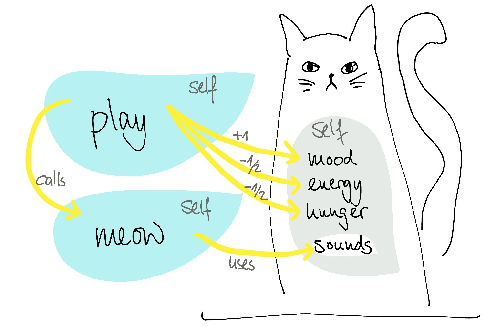
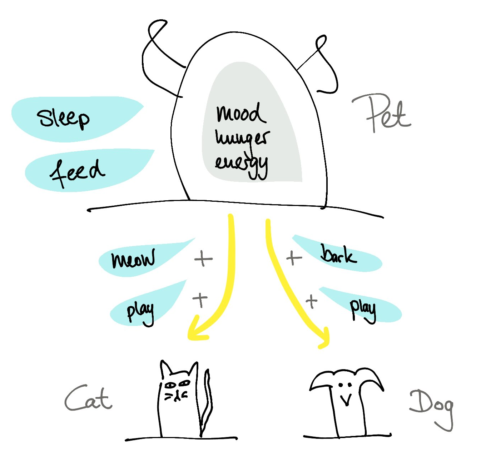

# Klassen und Objekte

## Klassendeklaration

```python
class KlassenName():
    ...
    ...   Deklaration
    ...
```

### Ein Beispiel mit Katze:


```python
class Cat():
    """Eine Klasse für Katzen."""

    sounds = ["MiauMiau!"]  #Variable, die von allen Instanzen der Klasse geteilt wird

    def __init__(self):     #Funktion die bei der Erstellung einer Instanz aufgerufen wird
        self.mood = 5       #Variablen, die für jede einzelne Instanz erstellt werden
        self.energy = 5
        self.hunger = 5

    def meow(self):
        for sound in self.sounds:
            print(sound)

    def play(self):
        self.mood += 1
        self.energy -= 0.5
        self.hunger += 0.5
        self.meow()
```

Die Klasse in Aktion:

```python
miez = Cat()        # Hier wird ein Objekt der Klasse Cat mit dem Variablennamen miez erstellt
miez.meow()         # Da miez ein Objekt der Klasse Cat ist, besitzt es die Methode meow
miez.play()         # In der Methode .play() wird auch die Methode .meow() aufgerufen
print(miez.mood)    # mood ist keine Methode, sondern ein Attribut. Daher wird es ohne Klammern () aufgerufen.
```



### Public and non-Public

In anderen Programmiersprachen sind die Attribute einer Klasse per default _private_ , in diesem Fall dürfen nur die Methoden der Klasse selbst die Attribute verändern. In Python sind alle Attribute von außen abruf- und veränderbar. Mit doppelten unterstrichen vor dem Variablennamen kann eine Variable jedoch "versteckt" werden.


```python
class Cat():
    """Eine Klasse für Katzen."""

    sounds = ["MiauMiau!"]

    def __init__(self):
        self.mood = 5        # kein Unterstrich: public
        self._energy = 5   # ein Unterstrich: soll wie non-public behandelt werden
        self.__hunger = 5  # doppelter Unterstrich: non-public

    def meow(self):
        for sound in self.sounds:
            print(sound)

    def play(self):
        self.mood += 1
        self._energy -= 0.5
        self.__hunger += 0.5
        self.meow()

    def sleep(self):
        self.mood += 1
        self._energy += 2

    def feed(self):
        self.mood += 1
        self.__hunger -= 1
```

Die Klasse in Aktion:

```python
private_miez = Cat()
private_miez.mood
private_miez.mood = 0
private_miez._energy # eine so benannte Variable abzurufen ist schlechter Stil
private_miez.__hunger # Variablen mit doppeltem Unterstrich können nicht abgerufen werden
private_miez.feed()
```

### Special (\Magic \Dunder) Methods

Es gibt spezielle Methoden die im Kontext von Klassen benutzt werden können, diese werden durch doppelte Unterstriche gekennzeichnet (Dunder = double under).

    __init__  # "Konstruktor" zum Erstellen es Objekts
    __str__   # Definiert, wie das Objekt durch die print() Funktion dargestellt wird
    __len__   # Definiert, was die len() Funktion auf dem Objekt zurückgibt

    __getitem__ #getitem und setitem ermöglichen das Zugeifen auf Einträge via Indizes
    __setitem__ #dann lässt sich auch über das Objekt iterieren (wie bei Listen, Arrays, ...)


... und noch einige mehr siehe z.B. [hier]("https://www.tutorialsteacher.com/python/magic-methods-in-python"). Mehr dazu in den Beispielen.


```python
class Cat():

    def __init__(self, mood = 5, hunger = 5, energy = 5):
        self.mood = mood
        self.hunger = hunger
        self.energy = energy

    def __str__(self): ## Definiere die Print-Ausgabe des Objekts
        return("Katze. Laune: " + str(self.mood) + ", Hunger: " + str(self.hunger) + \
               ", Energie: " + str(self.energy))

    def sleep(self):   #den Funktionen der Klasse muss die jeweilige Intanz (das Objekt) übergeben werden
        self.mood += 1
        self.energy += 2

    def play(self):
        self.mood += 1
        self.energy -= 1
        self.hunger += 1
        self.meow()

    def feed(self):
        self.mood += 1
        self.hunger -= 1

    def meow(self):
        print("MiauMiau")
```


```python
miez2 = Cat(mood = 3, hunger = 4, energy = 5) #wir können die Miez jetzt in einem gewählten Zustand initialisieren!
print(miez2.hunger)
print(miez) #Ohne __str__ Magic Method (Objekt von oben)
print("\n")
print(miez2) #mit __str__ Das ist hübscher!
```

### Vererbung (inheritance)

Klasseneigenschaften lassen sich auch an andere Klassen vererben, die Definition sieht dann wie folgt aus:

     class KlassenName(AndereKlasse):
        ...
        ...   Deklaration
        ...   

Angenommen wir möchten nun auch eine Klasse zu Hunden haben. Eine Variante möglichst Effizient zu arbeiten ist alle Eigenschaften die Katze und Hund gemeinsam haben in einer übergeordneten Klasse `Pet` zusammenzufassen.


```python
class Pet():

    def __init__(self, mood=5, hunger=5, energy=5):
        self.mood = mood
        self.hunger = hunger
        self.energy = energy

    def __str__(self):
        return("Haustier. Laune: " + str(self.mood) + ", Hunger: " + str(self.hunger) + \
               ":, Energie: " + str(self.energy))

    def sleep(self):   #den Funktionen der Klasse muss die jeweilige Intanz (das Objekt) übergeben werden
        self.mood += 1
        self.energy += 2

    def feed(self):
        self.mood += 1
        self.hunger -= 1
```


```python
class Cat(Pet):

    def meow(self):
        print("MiauMiau")

    def play(self):
        self.mood += 1
        self.energy -= 1
        self.hunger += 1
        self.meow()

class Dog(Pet):

    def bark(self):
        print("WauWau!")

    def play(self):
        self.mood += 1
        self.energy -= 1
        self.hunger += 1
        self.bark()
```


```python
rex = Dog()
garfield = Cat()

rex.play()

garfield.sleep()
print(garfield.mood)
```





### Polymorphismus (Vielgestaltigkeit)

Hier soll noch erwähnt sein, dass Funktionen aus der Elternklasse auch **überschrieben** werden können. Dies kann man unter anderem dafür nutzen, dass die selbe Methode bei ähnlichen Objekten verschiedene Resultate liefert - deshalb polymorph.

Hier das Gleiche wie oben nur anders.


```python
class Pet():

    def __init__(self, mood=5, hunger=5, energy=5):
        self.mood = mood
        self.hunger = hunger
        self.energy = energy

    def __str__(self):
        return("Haustier. Laune: " + str(self.mood) + ", Hunger: " + str(self.hunger) + \
               ":, Energie: " + str(self.energy))

    def sleep(self):   #den Funktionen der Klasse muss die jeweilige Intanz (das Objekt) übergeben werden
        self.mood += 1
        self.energy += 2

    def feed(self):
        self.mood += 1
        self.hunger -= 1

    def sound(self):
        raise NotImplementedError()

    def play(self):
        self.mood += 1
        self.energy -= 1
        self.hunger += 1
        self.sound()

class Cat(Pet):
    def sound(self):
        print("Miau!")

class Dog(Pet):
    def sound(self):
        print("Wuff!")        
```


```python
rex = Dog()
garfield = Cat()

rex.play()
garfield.play()
```


